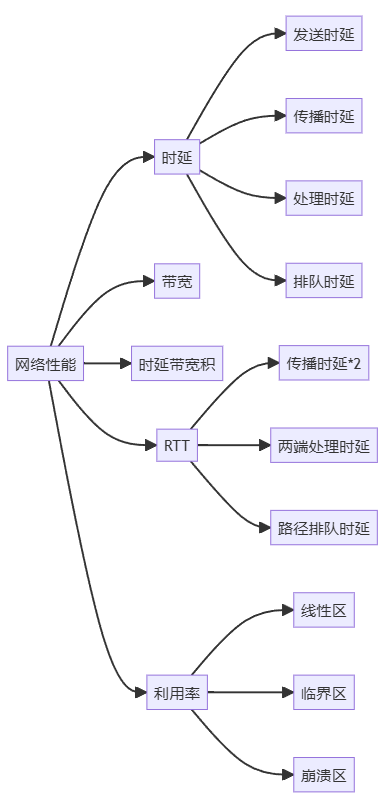
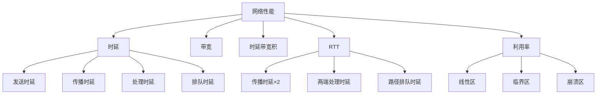

# 网络性能指标：速率、带宽与吞吐量

## 摘要

本课程解析速率、带宽、吞吐量的核心差异及测量方法，通过协议分层定位、实验验证和现实类比，构建可验证的性能评估体系。结合抓包命令与设备配置演示指标间的动态关系。

---

## 主题

**分层度量体系**：物理层带宽（信道容量）→ 数据链路层速率（接口比特率）→ 传输层吞吐量（端到端有效载荷）

> 重点难点
>
> - **带宽时延积**的管道模型类比（灌水实验验证）
> - **有效吞吐量**与协议开销的关系（TCP/IP 头部占比计算）
> - **速率单位陷阱**：bit vs Byte 的工程换算（数据表误解案例）

---

计算时延

## 线索区

### 物理层/带宽

> 简化的信道容量公式, 奈奎斯特准则 (Nyquist criterion) [此阶段非必须]
$$
C = 2B \log_2(M) \quad (\text{B:带宽, M:调制电平数})
$$

- **实验验证**：

  ```bash
  # 千兆以太网带宽测试（Linux）
  iperf3 -c 10.0.0.2 -t 30 -P 8 | grep sender
  # Windows 兼容方案
  jperf -c 10.0.0.2 -t 30 -i 1
  ```

- **抓包标识**：  
  Wireshark 统计图 → I/O Graph 显示**瞬时带宽**

### 数据链路层/速率

#### 比特填充时间计算

$$
t_{\text{bit}} = \frac{1}{R} \quad (R: 标称速率)
$$

比特时间就是你传输一个比特（0 或 1）需要的时间。标称速率 \( R \) 是你每秒能传输多少个比特。所以，比特时间就是标称速率的倒数。

- **MTU 关联**：  
  以太网**1500 字节**帧在 1Gbps 链路的传输耗时：

$$ t = \frac{1500 \times 8}{10^9} = 12\mu s $$

- **故障案例**：  
  误配速率导致 CRC 错误（`ethtool`显示**协商速率**异常）

### 传输层/吞吐量

理论最大吞吐量:

$$
Throughput_{\text{max}} = \frac{W_{\text{cwnd}}}{RTT} \times MSS
$$

- **TCP 窗口验证**：

  ```bash
  # 查看当前拥塞窗口（Linux）
  ss -ti | grep cwnd
  # 关键抓包过滤式
  tshark -r trace.pcap -Y "tcp.analysis.bytes_in_flight"
  ```

- **协议开销对比**：

  | 协议   | 头部开销 | 载荷效率（1500B MTU） |
  | ------ | -------- | --------------------- |
  | TCP/IP | 40B      | 1460/1500=97.3%       |
  | UDP/IP | 28B      | 1472/1500=98.1%       |

---

### 补充：计算机网络性能指标详解

---

#### **新增核心指标解析**

---

#### 一、时延带宽积（Bandwidth-Delay Product）

**定义**：  
$$ \text{时延带宽积} = R \times D_{\text{prop}} $$

- $R$：信道带宽（bps）
- $D_{\text{prop}}$：传播时延（秒）

**通俗解释**：  
信道能承载的"在途数据量"，类似水管中正在流动的水量。例如：

- 带宽 $1\,\text{Gbps}$ ，传播时延 $50\,\text{ms}$ → 时延带宽积 $= 1\,\text{Gb} \times 0.05\,\text{s} = 50\,\text{Mb}$
  表示此时信道中最多有 $50\,\text{Mb}$ 数据正在传输。

**比喻**：  
高速公路同时行驶的车辆数 = 车速（带宽） × 通过全程时间（传播时延）

---

### 二、往返时间（RTT, Round-Trip Time）

**定义**：  
数据从发送端出发到接收端，再返回确认的总时间。包含：

$$
\text{RTT} = 2 \times D_{\text{prop}} + D_{\text{proc}}^{\text{发送端}} + D_{\text{proc}}^{\text{接收端}} + D_{\text{queue}}
$$

**实验验证**：

```bash
# Linux下测量到百度的RTT
ping -c 4 www.baidu.com
```

输出示例：

```bash
rtt min/avg/max/mdev = 12.345/13.456/14.567/0.987 ms
```

**关键对照**：

| 概念     | 测量对象     | 典型值           |
| -------- | ------------ | ---------------- |
| 传播时延 | 单程物理链路 | 光纤 ≈5ms/1000km |
| RTT      | 往返全链路   | 中美 ≈150-200ms  |

---

### 三、利用率（Utilization）

**非线性影响机制**：

$$
D = \frac{D_0}{1-U} \quad (U < 1)
$$

- **\( U $<$ 0.5 \)**：时延平缓增长
- **\( U $>$ 0.7 \)**：时延急剧上升（雪崩效应触发区）
- **\( U $\to$ 1 \)**：时延趋向无穷大（网络瘫痪）

- **D**: 当前**时延 (Delay)**，受其他参数影响而变化。
- **D₀**: **基础时延 (Base Delay)** 或 **空载时延**，网络在极低负载下的固有时延，通常稳定。
- **U**: **网络利用率 (Utilization)** 或 **负载强度**，表示网络资源使用程度，范围为 0-1 或百分比。`U < 1` 表示网络利用率不能超过 100%，完全饱和状态不稳定。

**雪崩效应案例**：  
$40\,\text{Gbps}$ 链路在 $U = 75\%$ 时：

- 理论剩余带宽 $= 40\,\text{G} \times 25\% = 10\,\text{Gbps}$
- 实际因排队时延暴增，有效吞吐量可能骤降至不足 $5\,\text{Gbps}$

---

### 四、性能指标全景图





---

### **常见误解补充**

1. **时延带宽积**：

   - 误解：认为是传输速率
   - 正解：衡量信道数据承载能力的**空间维度指标**（单位：bit）

2. **RTT 测量**：

   - 误解：ping 时间=传播时延 ×2
   - 正解：好的，以下是包含路由器处理+排队时延的 RTT 公式，并使用 `$` 格式：
   - $RTT = 2D_{\text{prop}} + D_{\text{处理}} + D_{\text{排队}}$
     - $RTT$：往返时间
     - $D_{\text{prop}}$：传播时延
     - $D_{\text{处理}}$：路由器处理时延
     - $D_{\text{排队}}$：路由器排队时延

3. **利用率安全阈值**：

   - 误解：链路利用率越高越好
   - 正解：工程上通常控制 \( U < 50\% \) 以保持 QoS
   - 实际 $RTT$ 总大于 $2D_{\text{prop}}$

---

### **实验进阶**

**分离四类时延**：

```bash
# 步骤1：测量基线RTT（小包）
ping -s 32 目标IP

# 步骤2：增大包长触发发送时延主导
ping -s 1500 目标IP

# 计算差值：
发送时延 ≈ (1500-32)×8 / 带宽
```

**TCP 吞吐量估算**：  

$$
\text{实际吞吐量} = \frac{\text{窗口大小}}{\text{RTT}} \leq \min(\text{接收窗口}, \text{时延带宽积})
$$

---

通过这种结构化补充，原有知识体系中的时延分析、带宽测量等模块与新增的时延带宽积、RTT 深度解析形成完整闭环，同时通过对照表、公式推导和实验方案强化理解。

## 总结区

1. **分层度量体系**：
    - 物理层（带宽）→ 数据链路层（速率）→ 传输层（吞吐量）。
    - 重点：带宽时延积、有效吞吐量与协议开销、速率单位换算。

2. **时延计算**：
    - **D**（当前时延）受 **D₀**（基础时延）和 **U**（网络利用率）影响。
    - 公式：$D = \frac{D_0}{1-U} \quad (U < 1)$。

3. **带宽与速率**：
    - 信道容量公式：$C = 2B \log_2(M)$。
    - 比特填充时间：$t_{\text{bit}} = \frac{1}{R}$。

4. **吞吐量**：
    - 理论最大吞吐量：$Throughput_{\text{max}} = \frac{W_{\text{cwnd}}}{RTT} \times MSS$。
    - TCP/IP 头部开销：40B，效率 97.3%；UDP/IP 头部开销：28B，效率 98.1%。

5. **时延带宽积**：
    - 定义：$\text{时延带宽积} = R \times D_{\text{prop}}$。
    - 比喻：信道中“在途数据量”，类似水管中的水量。

6. **RTT（往返时间）**：
    - 公式：$RTT = 2D_{\text{prop}} + D_{\text{处理}} + D_{\text{排队}}$。
    - 测量：`ping` 命令。

7. **利用率与雪崩效应**：
    - $U < 0.5$：时延平缓增长；$U > 0.7$：时延急剧上升；$U \to 1$：网络瘫痪。

8. **实验与验证**：
    - 带宽测试：`iperf3` 或 `jperf`。
    - TCP 窗口验证：`ss -ti` 或 `tshark`。
