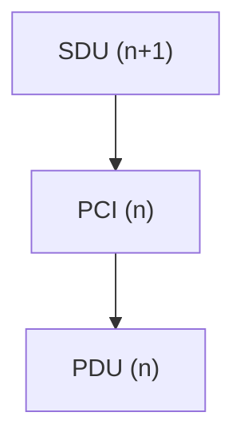

# 计算机网络分层结构

## 摘要

本课程解析计算机网络分层结构的核心原理，通过**协议栈分层模型**将复杂通信问题模块化。重点阐述各层功能定义、数据单元交互机制及分层设计原则，提供可验证的抓包实验方法，实现从理论到实践的闭环验证。

---

## 主题

网络分层架构通过**协议/接口/服务**三要素实现功能解耦，核心解决**跨设备协同**与**异构系统互通**问题。关键设计原则体现为**服务单向性**与**接口标准化**。

> **重点难点**
>
> - 协议数据单元(PDU)与接口服务单元(SDU)的转换关系
> - 分层结构中**垂直服务调用**与**水平协议交互**的差异
> - VLAN 标签在数据链路层的**透明传输机制**

---

## 线索区

### 分层架构实现原理

$$
% 数据封装过程公式化表达
PDU_n = SDU_{n+1} + PCI_n
$$

---

## 完整定义

在计算机网络的分层结构中，**PDU_n**（Protocol Data Unit，协议数据单元）是第 \( n \) 层的数据单元，

它由第 \( n+1 \) 层的 **SDU\_{n+1}**（Service Data Unit，服务数据单元）和第 \( n \) 层的 **PCI_n**（Protocol Control Information，协议控制信息）组成。

公式表示为：

$$
PDU_n = SDU_{n+1} + PCI_n
$$

[link](./WIKI/pdu.md)

- **PDU_n**：第 \( n \) 层的数据单元，包含实际数据和该层的控制信息。
- **SDU\_{n+1}**：第 \( n+1 \) 层传递给第 \( n \) 层的数据单元，是第 \( n \) 层需要传输的有效载荷。
- **PCI_n**：第 \( n \) 层的控制信息，用于实现该层的协议功能（如地址、校验和、序列号等）。

---

## 通俗语言描述

每一层在发送数据时，都会在上一层传递过来的数据（SDU）前面加上自己的控制信息（PCI），形成一个完整的数据单元（PDU）。这个过程就像寄快递：你把物品（SDU）交给快递员，快递员会在包裹上贴上快递单（PCI），形成一个完整的快递包裹（PDU）。

---

## 通俗比喻

想象你是一个作家，写了一本书（SDU）。出版社在出版时，会给书加上封面、目录和页码（PCI），最终形成一本完整的书（PDU）。每一层都像出版社一样，在上一层的数据基础上添加自己的“包装”，最终形成一个完整的数据单元。

---

## 主体与其它部分

### 主体

- **PDU_n**：第 \( n \) 层的完整数据单元，包含有效数据和控制信息。
- **SDU\_{n+1}**：第 \( n+1 \) 层传递给第 \( n \) 层的有效数据。
- **PCI_n**：第 \( n \) 层的控制信息，用于实现该层的协议功能。

### 其它部分

- **依赖关系**：每一层的 PDU 都依赖于上一层的 SDU 和本层的 PCI。
- **封装过程**：数据从上层传递到下层时，每一层都会添加自己的控制信息，形成新的 PDU。

---

## 依赖关系（使用 Mermaid 表示）



---

## 对照组

| 概念           | 定义                                     | 作用                                   |
| -------------- | ---------------------------------------- | -------------------------------------- |
| **PDU_n**      | 第 \( n \) 层的完整数据单元              | 包含有效数据和控制信息，用于传输       |
| **SDU\_{n+1}** | 第 \( n+1 \) 层传递给第 \( n \) 层的数据 | 第 \( n \) 层需要传输的有效载荷        |
| **PCI_n**      | 第 \( n \) 层的控制信息                  | 实现该层的协议功能（如地址、校验和等） |

---

## 常见误解

1. **误解**：PDU 和 SDU 是同一概念。

   - **纠正**：PDU 包含 SDU 和 PCI，是更完整的数据单元。

2. **误解**：PCI 是可有可无的。

   - **纠正**：PCI 是实现协议功能的关键，缺少 PCI 会导致数据传输失败。

3. **误解**：每一层的 PDU 大小都相同。

   - **纠正**：每一层的 PDU 大小可能不同，取决于该层的协议和网络条件。

4. **误解**：SDU 是原始数据，不需要任何处理。

   - **纠正**：SDU 是上一层传递下来的数据，可能已经经过封装或处理。

5. **误解**：PDU 只在发送端存在。
   - **纠正**：PDU 在发送端和接收端都存在，接收端会逐层解封装。

---

- **协议栈穿透实验**：

  ```bash
  # 观察HTTP-TCP-IP-Ethernet封装过程
  tcpdump -i eth0 -nnv 'tcp port 80' -w http.pcap
  ```

- **Wireshark 过滤**：  
  `frame.number == 1 && http` 显示首个 HTTP 请求的完整协议栈

### 数据单元交互机制

| 层级       | PDU 名称   | 关键字段             | 典型长度 |
| ---------- | ---------- | -------------------- | -------- |
| 应用层     | Message    | HTTP Header/Body     | 可变     |
| 传输层     | Segment    | **源端口**、窗口大小 | ≤65,535B |
| 网络层     | Packet     | TTL、**分片标识**    | ≤65,535B |
| 数据链路层 | Frame      | **MAC 地址**、FCS    | 64-1518B |
| 物理层     | Bit Stream | 前导码、曼彻斯特编码 | -        |

### 分层设计验证实验

**实验目标**：验证 TCP 重传机制与 IP 分片的关系

```bash
# Linux环境模拟MTU限制
sudo ifconfig eth0 mtu 500
# 触发TCP分段
curl http://testserver/largefile.zip
# 抓包分析
tshark -r trace.pcap -Y "tcp.analysis.retransmission || ip.flags.mf"
```

---

### 为什么需要分层结构？

#### **完整定义**

网络分层结构是一种将复杂的网络通信过程分解为多个独立层次的方法，每一层负责特定的功能，并通过标准化的接口与上下层进行交互。

#### **通俗描述**

想象一下，如果你要寄一封信，整个过程可以分为多个步骤：写信、装信封、贴邮票、投递到邮局、邮局分拣、运输、最终投递到收件人手中。每一步都有专门的职责，且每一步都依赖于前一步的完成。网络分层结构也是类似的，每一层都有特定的任务，且只与相邻的层进行交互。

#### **通俗比喻**

可以将网络分层结构比作一个工厂的生产线。每一层就像生产线上的一个工作站，负责特定的任务。例如，一个工作站负责组装零件，另一个工作站负责包装，最后一个工作站负责运输。每个工作站只需要知道如何与前后两个工作站交互，而不需要了解整个生产线的细节。

#### **主体与其它部分**

- **主体**：分层结构的核心思想是将复杂的网络通信过程分解为多个独立的层次，每一层只负责特定的功能。

- **其它部分**：每一层通过标准化的接口与上下层进行交互，确保不同厂商的设备可以互相通信。

---

### 如何进行分层？

#### 服务、协议、接口

1. **服务**：每一层为其上层提供的功能。例如，传输层为应用层提供可靠的数据传输服务。
2. **协议**：每一层内部使用的规则和约定，用于实现该层的功能。例如，TCP 协议用于实现可靠的数据传输。
3. **接口**：每一层与上下层交互的边界。接口定义了如何调用下层的服务以及如何为上层提供服务。

- **服务**：就像餐厅的服务员为顾客提供点餐、上菜等服务。
- **协议**：就像厨房内部的烹饪流程和规则，确保每道菜都能按时完成。
- **接口**：就像服务员与厨房之间的窗口，服务员通过窗口传递顾客的点单，厨房通过窗口送出做好的菜。

---

### 分层的基本原则

1. **功能独立性**：每一层只负责特定的功能，且功能之间相互独立。
2. **接口标准化**：每一层通过标准化的接口与上下层进行交互，确保不同厂商的设备可以互相通信。
3. **服务单向性**：每一层只能调用其下层的服务，而不能跨层调用。
4. **透明性**：每一层对其上层是透明的，上层不需要知道下层的具体实现细节。

- **功能独立性**：就像公司里的各个部门，财务部负责财务，人事部负责人事，各部门职责明确，互不干扰。
- **接口标准化**：就像公司内部的邮件系统，每个员工都使用相同的邮件格式和流程进行沟通。
- **服务单向性**：就像公司里的汇报关系，员工只能向直接上级汇报，而不能越级汇报。
- **透明性**：就像公司里的 IT 部门，员工只需要知道如何使用电脑，而不需要知道电脑是如何维护的。

---

## 总结区

### **核心考点**

1. 协议栈封装过程中**PCI 添加顺序**（自上而下递增）
2. **MTU 与 MSS 的制约关系**：
   - 以太网 MTU=1500 → TCP MSS=1460（扣除 IP/TCP 头）
3. **故障诊断线索**：
   - CRC 错误 → 物理层问题
   - ARP 超时 → 数据链路层地址解析失败

### **常见误解**

1. **误解**：分层结构中的每一层都是独立的，不需要与其他层交互。

   - **纠正**：每一层通过标准化的接口与上下层进行交互，确保数据的正确传输。

2. **误解**：分层结构中的每一层都可以跨层调用服务。

   - **纠正**：每一层只能调用其下层的服务，不能跨层调用。

3. **误解**：分层结构中的每一层都需要知道所有其他层的实现细节。

   - **纠正**：每一层对其上层是透明的，上层不需要知道下层的具体实现细节。

4. **误解**：分层结构中的每一层都可以随意修改协议。
   - **纠正**：每一层的协议是标准化的，不能随意修改，以确保不同厂商的设备可以互相通信。
