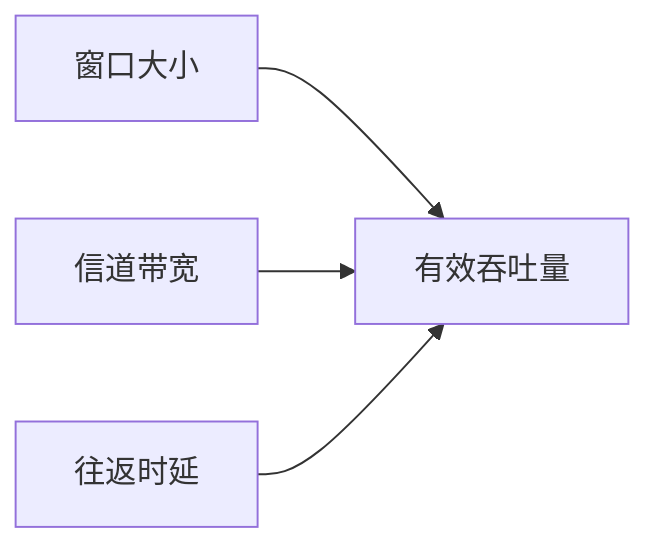

# 数据传输速率与带宽

## 摘要

本课程通过分层解析方法，将数据传输基础概念转化为可实验验证的知识体系。重点构建码元速率与信息速率的数学关系模型，并通过带宽参数连接物理层与数据链路层的实践验证。

## 主题

数据通信基础参数的三维解析：时间维度（速率计算）、空间维度（信道带宽）、信息维度（码元进制）。核心公式 \( R_b = R_B \times \log_2(M) \) 贯穿三层分析。

> 重点难点
>
> - 码元时长与波特率的反比关系
> - 多进制调制带来的信息增益
> - 奈奎斯特准则的实际限制

## 线索区

### 物理层：带宽特性

$$
信道带宽 B = f_{max} - f_{min} \quad (Hz)
$$

- 实验验证：`iperf3 -c 192.168.1.1 -t 10`（测量实际带宽）
- 现实类比：带宽如同高速公路车道数，**信道容量**类似最大通车量

### 数据链路层：码元传输

|          | 二进制     | 四进制  | 十六进制 |
| -------- | ---------- | ------- | -------- |
| 码元时长 | 1 μs       | 1 μs    | 1 μs     |
| 波特率   | 1 MBaud    | 1 MBaud | 1 MBaud  |
| 比特率   | **1 Mbps** | 2 Mbps  | 4 Mbps   |

- Wireshark 观察：`frame.time_delta` 过滤特定码元间隔
- 典型误码：`tshark -r capture.pcap -Y "data.len < 64"`

### 传输层关联分析

TCP 窗口调节与信道容量关系：



## 总结区

**核心公式验证实验**：

```bash
# 生成测试流量（Linux）
dd if=/dev/zero bs=**1500** count=1000 | nc 10.0.0.2 5000
# 实时监控（tcpdump）
tcpdump -i eth0 -nn -l 'port 5000' | awk '{print $1}' | hist
```

**关键参数对比**：

| 参数类型 | 物理意义 | 测量工具 | 典型值 |
|---|---|---|---|
| 波特率 | 信号变化频率 | 示波器 | 1.328 MBaud |
| 比特率 | 有效数据速率 | Wireshark | **5.312 Mbps** |
| 带宽 | 频率资源范围 | 频谱仪 | 20 MHz |

**故障排查提示**：

1. 实际吞吐量 << 理论值时检查：CRC 错误计数（`ethtool -S eth0`）
2. 突发传输延迟波动需验证：信道争用（`iftop -NB`）
3. 协议效率损耗估算：TCP 头部开销占比（`tshark -q -z io,stat,1,tcp.analysis.ack_rtt`）
