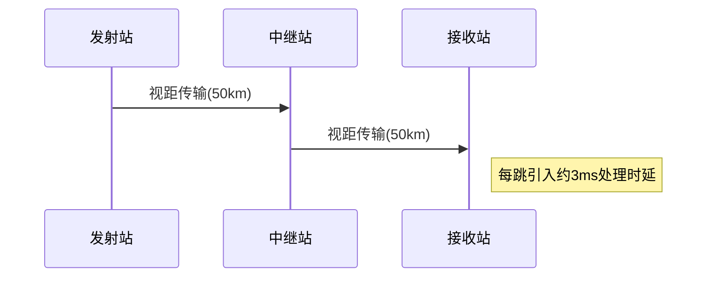

# 传输介质与光纤通信

## 摘要

本课程系统解析物理层传输介质分类与特性，聚焦光纤通信原理及无线传输技术。通过介质结构图解、参数对比、实验验证方法，构建可验证的物理层知识体系。重点实现光纤工作机制可视化解析与无线传输场景化对比。

## 主题

物理层传输介质技术解析与验证方法，包含：

- 导向/非导向介质特性对比
- 光纤全反射传输模型
- 多模/单模光纤工程选型
- 无线介质传播特性矩阵

> 重点难点
>
> - **光纤数值孔径计算**：纤芯/包层折射率关系
> - **模式色散机理**：多模光纤脉冲展宽现象
> - **自由空间损耗模型**：Friis 传输方程应用
> - **卫星通信传播时延**：静止轨道卫星 RTT 计算

## 线索区

### 知识点 1：传输介质分类矩阵

#### \#物理层

> **表1: 传输介质性能对比**

| 介质类型   | 带宽           | 典型距离 | 抗干扰      |
|------------|----------------|----------|-------------|
| UTP双绞线  | 100MHz         | 100m     | ★★          |
| 同轴电缆   | 1GHz           | 500m     | ★★★         |
| 多模光纤   | 1000MHz·km     | 2km      | ★★★★        |
| 单模光纤   | 10THz·km       | 80km+    | ★★★★★       |

> *注：抗干扰星级越高表示抗干扰能力越强，MHz·km 为光纤的带宽距离积*

```text
传输介质
├─ UTP双绞线 → 带宽 100MHz / 距离 100m
├─ 同轴电缆 → 带宽 1GHz / 距离 500m
├─ 多模光纤 → 带宽 1000MHz·km / 距离 2km
└─ 单模光纤 → 带宽 10THz·km / 距离 80km+
```

**Wireshark 过滤**：`eth.type == 0x0800`（IPv4 流量分析）  
**tcpdump 命令**：`tcpdump -i eth0 -vvv -c 100`（抓取物理接口前 100 帧）

---

### 知识点 2：光纤传输模型

#### 物理层

**关键参数**：

- **数值孔径** $NA = \sqrt{n1^2 - n2^2}$
- **模式色散** $\Delta\tau/L = \frac{n1Δ}{c}$ （Δ 为相对折射率差）

---

### 知识点 3：无线传输特性

\#物理层
**自由空间损耗模型**：

$$
L_{fs} = 32.45 + 20\log f(MHz) + 20\log d(km)
$$

**卫星时延计算**：  
同步轨道高度 35786km → 单程时延 $\frac{35786 \times 2}{3 \times 10^5} \approx 239ms$

**地面微波接力**：



---

## 总结区

### 核心考点

1. **光纤选型决策树**：

   - 传输距离<2km → 多模光纤（LED 光源）
   - 传输距离>2km → 单模光纤（激光光源）

2. **介质测试方法**：

   - 双绞线：`fluke链路测试仪（Cat5e: 100MHz@100m）`
   - 光纤：`光时域反射计（OTDR事件曲线解析）`

3. **典型参数速查**：
   - **单模光纤衰减**：0.2-0.4dB/km @1550nm
   - **5GHz WiFi 穿透损耗**：约 10dB/墙面

### 故障排查提示

- 光纤链路故障：先检查`端面清洁度`与`弯曲半径（>30mm）`
- 卫星通信中断：检查`雨衰补偿机制`是否触发

> 下阶段建议：结合 Wireshark 分析物理层帧结构，使用`tshark -T fields -e frame.interface_id`验证介质类型标识。
