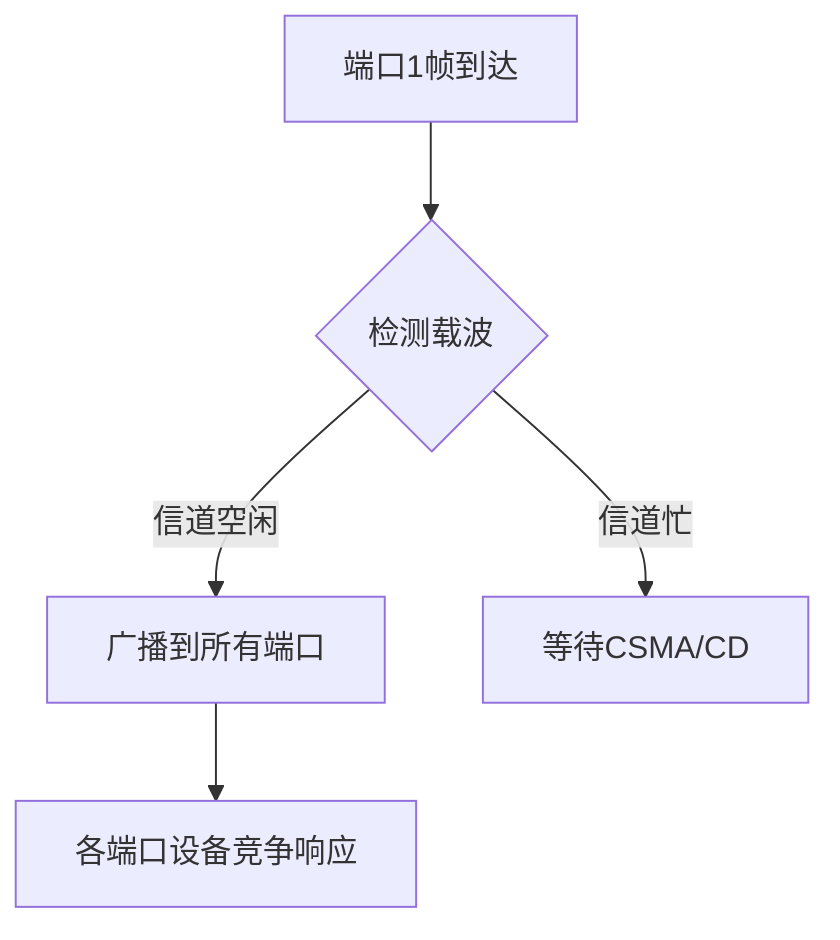

# 物理层设备：中继器与集线器（物理层）

## 摘要

本课解析物理层核心设备中继器（Repeater）与集线器（Hub）的工作原理及差异。中继器通过信号再生延长传输距离，集线器实现多端口信号广播转发。两者均受"5-4-3 规则"约束，且不处理数据链路层及以上协议。通过 Wireshark 对比实验验证广播特性，揭示物理层设备的信号处理本质。

---

## 主题

### 核心对比

| 特征     | 中继器       | 集线器              |
| -------- | ------------ | ------------------- |
| 端口数量 | 双端口       | 多端口（4/8/16 等） |
| 拓扑结构 | 线性扩展     | 星型拓扑            |
| 信号处理 | 逐比特再生   | 广播转发            |
| 冲突域   | 扩大冲突域   | 创建单一冲突域      |
| 典型应用 | 同轴电缆网络 | 双绞线以太网        |

> 重点难点
>
> - **信号再生原理**：中继器的"重新定时（Retiming）"与"重新整形（Reshaping）"过程
> - **冲突域扩展**：集线器导致所有端口共享带宽（例：100Mbps 集线器连接 8 台设备，每端口理论带宽**12.5Mbps**）
> - **5-4-3 规则**：以太网最多 5 个网段/4 个中继设备/3 个混合网段

---

## 线索区

### 知识点 1：中继器原理

```latex
信号处理流程：
原始信号 → 信号检测 → 噪声过滤 → 时钟恢复 → 信号再生 → 输出
```

- **电气特性**：信号再生时延 < 1μs（典型值）
- **协议约束**：两端必须匹配速率（10/100/1000Mbps）和编码方式（如曼彻斯特编码）
- **实验验证**：

  ```bash
  # Linux下模拟信号衰减场景
  tc qdisc add dev eth0 root netem loss 30% # 设置30%丢包率
  tcpdump -i eth0 -vvv 'ether proto 0x88b5' # 捕获特定工业以太网协议
  ```

### 知识点 2：集线器工作机制



- **冲突检测**：采用 CSMA/CD 机制，最大重试次数**16 次**
- **性能参数**：
  - 转发延迟：< 4.8μs（100BASE-TX 标准）
  - 最大级联数：4 层（受 5-4-3 规则限制）
- **抓包特征**：

  ```wireshark-filter
  eth.dst == ff:ff:ff:ff:ff:ff && frame.len < 64  # 捕获集线器广播的短帧
  ```

---

## 总结区

### 核心结论

1. 中继器是物理信号放大器，集线器是物理层多端口转发器
2. 两者均工作在 OSI 物理层，不解析 MAC 地址/IP 地址
3. 集线器构建的冲突域规模直接影响网络性能

### 典型考点

- 计算最大网络直径（使用 5-4-3 规则）
- 分析集线器网络吞吐量（公式：$Throughput = \frac{1}{1 + 5.44a}$，a=传播时延/传输时延）
- 识别物理层故障现象（如 CRC 错误激增但 MAC 帧结构完整）

### 实验建议

```bash
# Windows PowerShell诊断命令
Get-NetAdapter | Where {$_.MediaType -eq "802.3"} | Format-List *
ping -f -l 1472 192.168.1.1 # 测试MTU设置（1472+28=1500）
```

> **扩展思考**：在现代网络中使用集线器进行安全监控的可行性（对比端口镜像技术）
