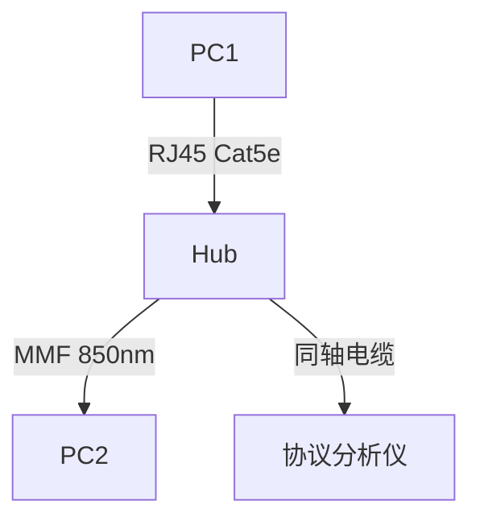

# 物理层概述与数据通信技术

## 摘要

本课程解析物理层核心功能与数据通信关键技术，通过分层协议分析、抓包实验设计和拓扑模拟，构建可验证的物理层知识体系。涵盖信号编码、传输介质、交换方式等核心内容，提供 tcpdump/Wireshark 实战命令。

## 主题

物理层通过比特流传输实现设备间通信，定义机械/电气/功能/规程四大接口特性。核心包含数据通信模型（单工/双工）、信号编码（曼彻斯特/差分曼彻斯特）、传输介质（双绞线/光纤）、数据交换方式（电路/分组）等技术模块。

> 重点难点
>
> - 曼彻斯特编码时钟同步实现原理
> - 奈奎斯特准则与香农定理的应用场景区分
> - 虚电路交换与数据报交换的时延差异
> - 集线器广播域与冲突域特性

## 线索区

### [物理层] 接口特性

- **机械特性**：RJ45接口尺寸/引脚排列（**ISO 8877标准**）
- **电气特性**：电平范围（**RS-232使用±15V**）
- **功能特性**：引脚定义（Tx/Rx/CTS/RTS）
- **规程特性**：接口交互时序（**PPP链路建立流程**）

**关键标准解析**：

- **ISO 8877**：定义 RJ45 8P8C 接口的物理尺寸和触点布局
- **RS-232**：规范电压范围（逻辑1: -15V~-3V，逻辑0: +3V~+15V）
- **PPP 流程**：包含 LCP 链路协商 → PAP/CHAP 认证 → NCP 协议配置

**实验验证**：

```bash
# 查看网卡物理特性（Linux）
ethtool eth0 | grep "Speed\|Duplex"
# 捕获RS-232串口数据（Windows）
tshark -i COM1 -Y "serial"
```

### [数据通信] 编码与调制

**对比表格**：

| 编码类型 | 时钟同步 | 直流分量 | 典型应用 |
|---------|----------|---------|---------|
| 非归零码 | 无 | 有 | 短距离传输 |
| 曼彻斯特 | 跳变沿同步 | 无 | 以太网 |
| 差分曼彻斯特 | 跳变沿同步 | 无 | 令牌环网 |

**Wireshark 分析**：

```python
# 以太网帧前导码过滤（含曼彻斯特编码同步头）
frame.preamble == aa:aa:aa:aa:aa:aa:aa:ab
```

### [传输介质] 性能参数

**关键指标**：

- 双绞线：**衰减@100MHz ≤21.6dB/100m**（Cat6A 标准）
- 多模光纤：模态带宽 **2000MHz·km@850nm**
- 同轴电缆：特性阻抗 **75Ω（数字视频）/50Ω（射频）**

**故障排查命令**：

```bash
# 检测光纤链路质量（Cisco设备）
show interfaces transceiver details | include RxPower
```

## 总结区

### 核心考点

1. 接口特性四要素在设备选型中的应用（如工业场景选用 DB9 接口的机械特性）
2. 编码方式对传输质量的影响（曼彻斯特编码解决基线漂移问题）
3. 香农定理计算信道极限速率：$C = B \log_2(1 + S/N)$

### 实验重点

- 使用示波器观测曼彻斯特编码波形（注意跳变沿对齐时钟周期）
- 通过误码率测试比较 UTP/STP 电缆抗干扰能力
- 搭建 HUB 网络观察冲突域现象（对比交换机行为）

### 拓扑实践



---

本结构通过分层协议标签、实验验证命令、关键参数标注等方式，构建可抓包验证的物理层知识框架。重点关联理论参数（如奈奎斯特频率）与实操指标（如光纤接收功率），满足网络架构实践的深度需求。
