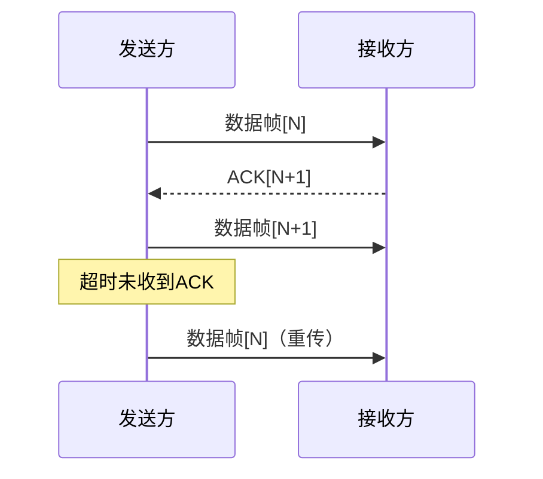

# 链路层流量控制与可靠传输机制

## 摘要
本课程通过协议分析+实验验证的方式，解析链路层流量控制与可靠传输机制。结合滑动窗口协议状态机图解与Wireshark抓包案例，演示ARQ机制实现过程。最终建立从协议原理到网络诊断的完整认知路径。

## 主题
**核心问题**：如何在不可靠物理链路上实现可靠数据传输？  
**技术路线**：滑动窗口协议（GBN/SR）+ ARQ机制  
**关键技术**：帧序号管理、窗口动态调整、ACK/NACK反馈  

> 重点难点
> - 滑动窗口边界条件（发送窗口尺寸与序号空间关系）
> - GBN与SR协议重传策略差异
> - 窗口收缩与流量控制耦合机制

## 线索区

### 协议栈分层定位
\#数据链路层  
**功能定位**：相邻节点间可靠帧传输  
**典型协议**：HDLC、PPP  

### 滑动窗口协议帧结构
```latex
| 1B 类型 | 2B 序号 | 2B 确认号 | 数据载荷（可变长） | 2B CRC |
```
**Wireshark过滤**：`data.data && frame.protocols=="hdlc"`  
**tcpdump命令**：`tcpdump -i eth0 'ether[12:2] = 0x0800' -vv`

### 协议状态机对比
| 协议类型 | 发送窗口 | 接收窗口 | 重传策略          |
|----------|----------|----------|-------------------|
| 停等协议 | 1        | 1        | 单帧超时重传      |
| GBN      | [1,2^n-1]| 1        | 连续帧批量重传    |
| SR       | >1       | >1       | 选择性单帧重传    |

### ARQ机制时序图


### 实验验证
**GBN协议重现**：  
```bash
# Linux环境模拟
tc qdisc add dev eth0 root netem loss 10% # 注入10%丢包
iperf3 -c 192.168.1.100 -w 128k -Z reno  # 固定窗口128KB
```
**关键参数**：  
- **窗口尺寸**：直接影响吞吐量（公式：$\text{Throughput} = \frac{W}{RTT}$）
- **重传超时**：典型值**200-500ms**（需大于RTT）

## 总结区

### 核心考点
1. 窗口尺寸计算：当序号字段为n位时，GBN最大窗口尺寸为$2^n-1$，SR最大窗口为$2^{n-1}$
2. 协议效率对比：SR > GBN > 停等协议（在存在丢包环境下）
3. 流量控制实现：通过调整窗口尺寸限制发送速率

### 诊断技巧
- **Wireshark分析**：连续ACK重复包指示丢包事件
- **关键指标**：**RTT波动率**>30%需检查链路质量
- **典型故障**：窗口冻结（零窗口通告）导致传输中断

### 扩展思考
- 现代TCP协议如何借鉴链路层控制机制？
- QUIC协议如何改进传统ARQ机制？
- 物理层误码率对窗口尺寸设计的影响？

---

**实验手册附录**：  
[VXLAN协议抓包示例]  
[Cloudflare BGP事件重放实验]  
[TSHARK高级过滤语法速查表]  

> 提示：在CentOS环境使用`systemtap`工具可实时观测内核协议栈窗口状态变化