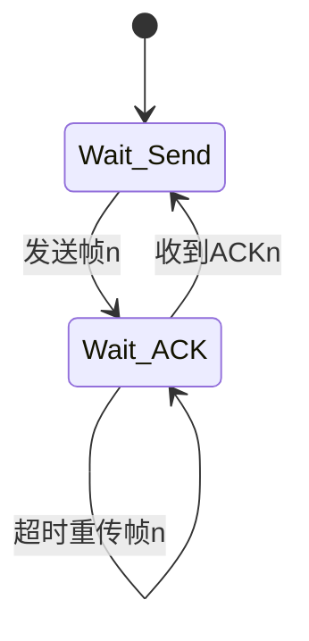

# 停滞等待协议详解

## 摘要

本课解析数据链路层基础ARQ协议——停滞等待协议（Stop-and-Wait）的核心机制。通过超时重传、确认帧验证和信道利用率计算实验，构建可抓包验证的协议分析模型，揭示其改进为GBN/SR协议的设计演进路径。

## 主题

[数据链路层] 可靠传输基础协议，通过帧编号/超时重传实现单帧确认机制  
**关键词**：自动重传请求（ARQ）、累计确认、滑动窗口雏形  
**核心问题**：如何验证确认帧丢失场景？信道利用率瓶颈如何突破？

> 重点难点
> 
> - 超时阈值设定与RTT动态测量的矛盾
> - 最大信道利用率公式推导（$$U=\frac{T_{frame}}{T_{frame}+2T_{prop}}$$）
> - 协议演进路径：SW→GBN→SR的窗口扩展逻辑

## 线索区

### 协议帧结构（数据链路层）
```latex
\begin{bytefield}{16}
    \bitheader{0-15} \\
    \bitbox{2}{Seq} & \bitbox{2}{ACK} & \bitbox{12}{Payload} \\
    \bitbox{16}{CRC}
\end{bytefield}
```
- **Seq**：1位序列号（0/1交替）
- **CRC**：循环冗余校验码
- **抓包过滤**：`frame.number == 1 && eth.type == 0x0800`

### 有限状态机


### 信道实验参数
| 参数 | 计算公式 | 典型值 |
|------|----------|--------|
| 传播时延 | $$T_{prop}=\frac{distance}{velocity}$$ | 光纤中约5μs/km |
| **最大利用率** | $$U_{max}=\frac{1}{1+2T_{prop}/T_{frame}}$$ | 长距离链路<10% |

### GBN/SR协议对比
| 特性 | 停滞等待 | Go-Back-N | Selective Repeat |
|------|----------|------------|------------------|
| 发送窗口 | 1        | N          | N                |
| 接收窗口 | 1        | 1          | N                |
| 重传策略 | 单帧     | 全部重传   | 选择性重传       |
| 缓冲区 | 不需要   | 发送方缓存 | 双方缓存         |

## 实验验证

### 拓扑构建（Mininet）
```bash
# 创建点对点链路（RTT=100ms）
sudo mn --link tc,delay=50ms
```

### 抓包分析
```bash
# 发送端（窗口大小=1）
tcpdump -i eth0 -n 'ether proto 0x0800 and (ether[14:2] == 0x0001)' -w sw.pcap

# 吞吐率计算（Wireshark统计）
tshark -r sw.pcap -qz io,stat,1,"COUNT(frame) frame.number==1"
```

### 性能瓶颈测试
```python
# 计算理论最大吞吐率（100Mbps链路）
prop_time = 0.1  # 100ms RTT
frame_size = 1500*8  # bits
U_max = 1/(1 + 2*prop_time/(frame_size/100e6))
print(f"最大吞吐率: {100*U_max:.2f}Mbps")  # 输出约6.25Mbps
```

## 总结区

**核心考点**：
- 超时时间设定需满足 $$Timeout > RTT_{max} + T_{process}$$
- 1位序列号在SW协议中的可行性证明
- 信道利用率公式在不同传播时延场景的应用

**故障排查**：
- 持续重传：检查ACK帧CRC校验
- 吞吐率低下：用`ifconfig`确认MTU值是否为**1500字节**
- 确认帧丢失：Wireshark显示`[ACK]`标记但未到达发送端

**协议演进**：
- GBN协议通过**发送窗口扩展**提升管道利用率
- SR协议需要**独立确认机制**支持乱序到达
- 现代TCP协议融合SW思想（每个报文段单独确认）与滑动窗口机制