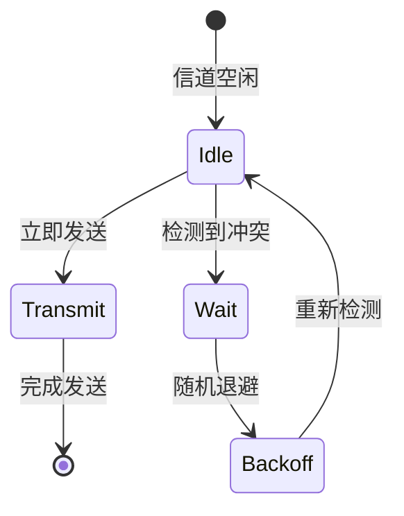

# 令牌传递协议与MAC协议总结

## 摘要
本课程解析令牌传递协议的工作特性与MAC协议分类方法，通过拓扑场景对比揭示不同协议的适用边界。结合Wireshark实验验证协议行为，重点演示负载变化对令牌环网效率的影响，为局域网协议选型提供决策依据。

## 主题
数据链路层信道分配策略对比与实现细节（[数据链路层/MAC子层]）

> 重点难点
> 
> - 令牌传递协议的时间敏感特性（逻辑环vs物理星型拓扑）
> - 动态信道划分中CSMA/CD与CSMA/CA的物理层差异
> - 轮询协议的信道利用率数学模型推导

---

## 线索区

### 知识点1：令牌传递协议帧结构
```latex
\begin{figure}[h]
\centering
\fbox{
\begin{bytefield}[endianness=big]{32}
\bitheader{0-31} \\
\bitbox{8}{起始定界符} & \bitbox{8}{访问控制} & \bitbox{8}{帧控制} \\
\bitbox{24}{目的地址} & \bitbox{8}{源地址} \\
\bitbox{16}{数据字段} & \bitbox{16}{FCS} \\
\bitbox{8}{结束定界符} & \bitbox{8}{帧状态}
\end{bytefield}
}
\caption{令牌环帧结构（符合IEEE 802.5标准）}
\end{figure}
```

**Wireshark过滤**：`token-ring.type == 0x0005`

---

### 知识点2：MAC协议对比矩阵
| 协议类型       | 典型协议       | 冲突处理    | 信道利用率          | 适用场景           |
|----------------|----------------|-------------|---------------------|--------------------|
| 静态划分       | FDMA/TDMA      | 无          | 固定分配            | 蜂窝网络           |
| 随机访问       | CSMA/CD        | 冲突检测    | 高负载时下降        | 有线以太网         |
| 轮询访问       | 令牌环         | 令牌控制    | $\frac{1}{1+a}$*   | 工业控制网络       |

*注：a=传播延迟/传输延迟

---

### 知识点3：CSMA协议状态机


**实验验证命令**：
```bash
# Linux环境模拟冲突
tc qdisc add dev eth0 root netem delay 10ms reorder 25%
tcpdump -i eth0 -w token_ring.pcap 'ether proto 0x0005'
```

---

## 总结区

### 协议特性对比
1. **令牌环网**：
   - 确定性延迟特性符合IEC 61158工业网络标准
   - 典型故障模式：令牌丢失（需beacon帧检测）

2. **CSMA/CD**：
   - 冲突窗口计算：$2\tau = \frac{2D}{v}$（D为最大距离，v信号速率）
   - 10BASE5网络最大传输距离**185米**设计依据

### 抓包分析要点
- 令牌环帧中访问控制字段的优先级位解析
- 冲突事件在Wireshark中表现为CRC错误帧突增
- 网络负载>70%时观察令牌循环时间波动

### 扩展思考
当VXLAN隧道封装令牌环帧时，如何保持确定性传输特性？（结合SDN架构分析）