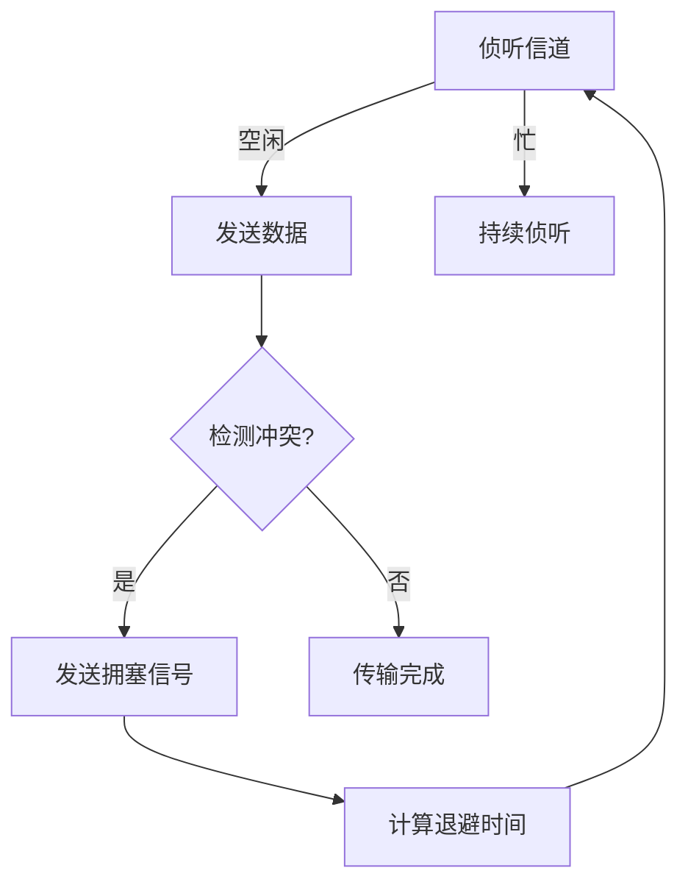

# 局域网的基本概念、体系结构与标准

## 摘要  
本课程系统解析局域网的五大核心特征（覆盖范围/速率/延迟/误码率/信道共享），通过拓扑结构对比、介质访问控制原理拆解、IEEE 802标准映射，构建可验证的局域网认知框架。结合Wireshark过滤表达式与tcpdump命令，提供从理论到抓包验证的完整学习路径。

## 主题  
局域网通过物理拓扑与逻辑拓扑的分离实现灵活组网，CSMA/CD、令牌环等介质访问控制机制解决信道争用问题。关键要掌握**拓扑结构差异**、**MAC子层运作**、**协议标准对应关系**。

> 重点难点  
> - **物理拓扑与逻辑拓扑的映射关系**（如以太网物理星型逻辑总线）  
> - **CSMA/CD二进制指数退避算法**的冲突解决机制  
> - **令牌环网延迟计算**与吞吐量关系  
> - **LLC子层服务访问点(SAP)** 的多协议支持原理  

---

## 线索区  

### 知识点1：拓扑结构对比验证  
**物理层验证命令**：  
```bash
# 查看网络接口物理连接状态（Linux）
ethtool eth0 | grep "Link detected"
# 星型拓扑检测（需配合交换机LED状态观察）
```

| 拓扑类型 | 物理结构 | 逻辑结构 | 故障影响 | 抓包特征 |
|---------|----------|----------|----------|----------|
| 总线型   | 直线连接 | 广播信道 | 全线瘫痪 | 冲突帧频现 |
| 星型     | 中心节点 | 点对点   | 单点失效 | ARP请求集中 |
| 环型     | 闭合环路 | 令牌传递 | 单点断链 | 令牌帧周期性出现 |

**Wireshark过滤技巧**：  
- `eth.addr == ff:ff:ff:ff:ff:ff` 捕获广播流量（总线型特征）  
- `token-ring.type == 0x0000` 识别令牌环控制帧  

---

### 知识点2：介质访问控制机制  
**CSMA/CD协议状态机**：  


**关键参数验证**：  
```bash
# 查看以太网卡冲突计数（Linux）
cat /sys/class/net/eth0/statistics/collisions
# 设置MTU值验证帧碎片化
ifconfig eth0 mtu 1480
```

**令牌环网延迟公式**：  
$$ 总延迟 = 传播延迟 + N \times 转发延迟 $$  
其中N为站点数，可通过`ping -R`实现路由追踪验证  

---

### 知识点3：IEEE 802标准矩阵  
**协议栈分层验证**：  
```bash
# 显示MAC地址（数据链路层）
ifconfig eth0 | grep "HWaddr"
# 捕获LLC帧（需支持SNAP头部）
tshark -i eth0 -Y "llc"
```

| 标准号 | 对应技术 | 帧结构特征 | 典型应用 |
|--------|----------|-------------|----------|
| 802.3  | 以太网   | 前导码+SFD  | 企业办公网 |
| 802.5  | 令牌环   | 访问控制字段 | 工业控制 |
| 802.11 | Wi-Fi    | PLCP前导码  | 无线接入 |
| 802.1Q | VLAN     | 4字节标签   | 虚拟组网 |

**VLAN抓包示例**：  
```tcpdump -i eth0 -nn -e vlan
# 显示带802.1Q标签的帧
```

---

## 总结区  
**核心考点**：  
1. 拓扑结构选择依据（成本/扩展性/可靠性综合评估）  
2. CSMA/CD与令牌传递的性能对比（轻载/重载场景差异）  
3. MAC地址与IP地址的层级映射关系（ARP协议抓包分析）  

**实验设计建议**：  
- 通过`tcpreplay`构造冲突流量观察退避算法  
- 使用`macchanger`修改MAC地址验证地址学习机制  
- 配置虚拟接口对比不同MTU值的分片行为  

**故障排查线索**：  
- 高冲突率→检查网卡双工模式`ethtool eth0`  
- 令牌丢失→环网监控器日志分析  
- LLC通信失败→检查SAP值配置  

> 下阶段建议：通过GNS3搭建多拓扑混合网络，使用Wireshark对比不同介质访问控制机制的实际帧结构差异。