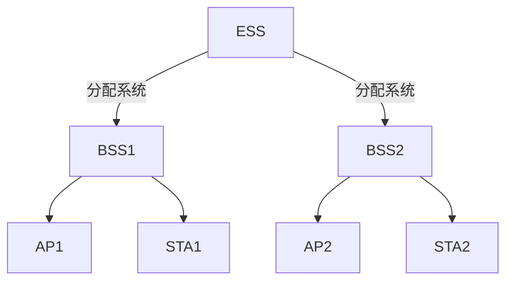
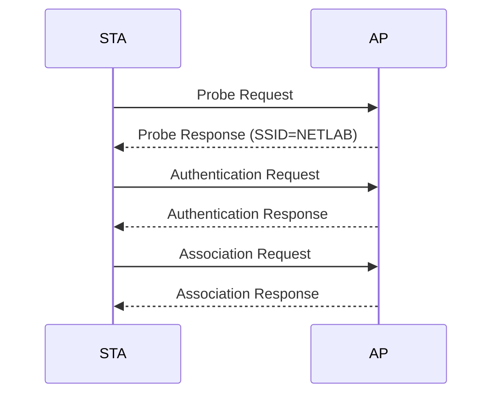

# 无线局域网与802.11标准

## 摘要
本课通过协议分析与拓扑建模方法，解析802.11 WLAN的核心工作机制。通过MAC帧结构拆解、ESS/BSS拓扑实验复现，掌握无线网络抓包诊断能力。重点构建基于Wireshark的802.11帧分析技能，为无线网络故障排查奠定基础。

## 主题
**协议栈分层**：数据链路层（MAC帧） / 网络层（漫游）  
**核心拓扑**：  


> 重点难点
> - **MAC地址字段动态映射**：同一帧中RA/TA与DA/SA的对应关系随帧类型变化
> - **IBSS网络自组织**：无AP场景下的分布式协调功能（DCF）实现
> - **隐藏节点问题**：RTS/CTS握手机制在物理层的实现差异

---

## 线索区

### 知识点1：MAC帧结构解析
**协议帧结构**（802.11 Data Frame）：
```
| Frame Control | Duration | Addr1(RA) | Addr2(TA) | Addr3 | Sequence | Addr4 | Frame Body |
| 2 bytes       | 2        | 6         | 6         | 6     | 2        | 6     | 0-2312    |
```

**地址字段逻辑**：  
- **Addr1**：接收端无线接口地址（RA）  
- **Addr2**：发送端无线接口地址（TA）  
- **Addr3**：最终目标系统地址（DA）  
- **Addr4**：仅在WDS桥接时使用  

**实验验证**：  
```bash
# Linux抓取管理帧（关联/认证过程）
tcpdump -i wlp3s0 -enn -s0 'type mgt subtype assoc-req' -w wlan-auth.pcap
```
```wireshark
# Wireshark过滤ESS拓扑漫游过程
wlan.fc.type == 0 && (wlan.fc.subtype == 8 || wlan.fc.subtype == 5) 
```

### 知识点2：BSS/ESS拓扑构建
**基础设施模式**：  


**漫游关键参数**：  
| 参数           | 典型值       | 抓包标识        |
|----------------|-------------|----------------|
| Reassociation | **15.6ms**  | subtype=0x02   |
| Beacon Interval| **102.4ms** | subtype=0x08   |
| DTIM Period    | **3**       | tag:DTIM Count|

### 知识点3：Ad-hoc网络特性
**组网特征对比**：  
| 特性            | Infrastructure模式 | IBSS模式       |
|----------------|--------------------|----------------|
| 协调节点        | AP（固定）          | **动态选举**    |
| 信道选择        | AP指定             | 首节点决策      |
| 功耗管理        | AP协调             | **CSMA/CA竞争**|

**典型故障场景**：  
```bash
# 检测隐藏节点问题（Linux）
iw dev wlan0 station dump | grep "tx retries"
# 高重传率表明存在信号覆盖盲区
```

---

## 总结区

**核心考点**：  
1. MAC帧四地址在WDS桥接场景的应用（**地址字段映射关系**）  
2. ESS漫游过程中802.11r协议快速切换实现（**FT协议交互分析**）  
3. 802.11n与11ac的物理层帧结构差异（**HT/VHT帧格式对比**）  

**实验重点**：  
- 使用`aircrack-ng`工具集捕获802.11控制平面流量  
- 通过Beacon帧中的**SSID长度字段**识别隐藏网络  
- 分析Auth帧的status code字段定位关联失败原因  

**扩展思考**：  
当STA同时收到多个AP的Probe Response时，如何根据802.11k标准进行智能选点？