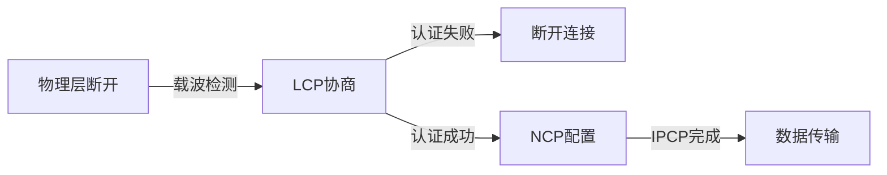

# PPP协议与HDLC协议

## 摘要
本课解析PPP与HDLC两大广域网协议，通过**协议帧结构对比**、**透明传输机制实验验证**和**典型抓包策略**，构建可验证的数据链路层知识体系。重点掌握PPP的LCP/NCP协商流程与HDLC的0比特插入法实现原理。

---

## 主题
**广域网协议实现机制与抓包验证方法**  
`PPP协议栈` `HDLC帧结构` `透明传输对比` `LCP协商过程`

> 重点难点
> - PPP三次握手与协议字段映射关系
> - 0比特插入法的二进制级实现
> - 两种协议透明传输机制差异

---

## 线索区

### 协议分层定位
**数据链路层协议**  
▸ **物理介质**：同步/异步串行链路  
▸ **典型应用**：PPP→ADSL宽带接入，HDLC→SDH传输网络  

)

---

### PPP协议帧结构
**字节对齐格式**（每字段长度单位为字节）：
```
| 7E | FF | 03 | 协议(2) | 信息(≤1500) | FCS(2) | 7E |
```
- **透明传输**：7D 5E替换7E，7D 5D替换7D（ASCII字符转义）
- **抓包过滤**：`ppp.type == 0x0021`（IP数据报）  
- **实验命令**：  
  ```bash
  # Linux PPPoE抓包
  tcpdump -i ppp0 -vv -w ppp_session.pcap
  ```

---

### HDLC帧结构
**比特流格式**：
```
| 01111110 | 地址(8) | 控制(8) | 信息(变长) | FCS(16) | 01111110 |
```
- **0比特插入**：连续5个1后强制插入0（硬件实现）
- **抓包特征**：`hdlc.control == 0x0f`（无编号帧）  
- **传输验证**：
  ```bash
  # Cisco设备HDLC调试
  debug serial interface
  ```

---

### 关键过程对比
| 特征                | PPP                          | HDLC                 |
|---------------------|------------------------------|----------------------|
| 链路建立            | LCP协商（CHAP/PAP认证）      | 固定预配置           |
| 透明传输机制        | 字符填充（7D转义）           | 比特填充（0插入）    |
| 多协议支持          | NCP动态协商（IP/IPX等）      | 仅支持单一网络协议   |
| 典型抓包标识        | Protocol字段区分载荷类型     | Control字段定义帧类型|

---

### 状态机图解
**PPP链路建立流程**：


---

## 实验验证区
### 实验1：PPP字符填充观测
**操作步骤**：
1. 在Linux中建立PPPoE连接
2. 使用`tshark -i ppp0 -Y "ppp && frame contains 7d"`捕获转义字符
3. 对比原始数据与抓包数据的十六进制差异

**预期现象**：观测到0x7E被替换为0x7D 0x5E的转义序列

---

### 实验2：HDLC比特填充验证
**设备需求**：Cisco路由器+串行链路  
**调试命令**：
```cisco
Router# debug serial interface
%LINK-3-UPDOWN: Interface Serial0/0, changed state to up
%LINEPROTO-5-UPDOWN: Line protocol on Interface Serial0/0, changed state to up
```
**验证要点**：通过比特流分析工具观测连续5个1后的0插入现象

---

## 总结区
**核心考点**：
- PPP协议三次握手各阶段协议字段变化（LCP→NCP→IPCP）
- HDLC控制字段三种帧类型识别（I帧/0x00, S帧/0x01, U帧/0x03）
- **MTU限制**：PPP默认1500字节 vs HDLC无固定限制

**故障排查提示**：
- PPP连接失败时检查LCP协商报文中的MRU参数匹配
- HDLC链路CRC错误突增需检查物理层时钟同步状态

```network-diagram
[PC]--PPP-->[Modem]--HDLC-->[ISP Router]
```