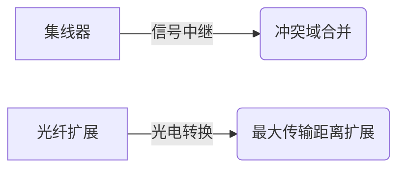

# 网络设备与链路层技术

## 摘要
本课程解析链路层设备（网桥/交换机）与网络层设备（路由器）的功能差异，通过协议分层视角揭示冲突域/广播域隔离机制。结合Wireshark抓包特征与网络拓扑实验，验证不同网络设备的流量控制特性。

---

## 主题
**分层设备控制域**：通过物理层→链路层→网络层设备演进，实现冲突域与广播域的逐级隔离  
**核心协议机制**：透明网桥自学习算法、交换机帧转发模式（直通式vs存储转发式）  
**拓扑验证要素**：MAC地址表构建过程、广播帧传播范围、端口速率协商差异  

> 重点难点
> - 物理层/链路层设备对冲突域处理的本质区别
> - 透明网桥转发表动态更新与环路避免机制
> - 直通式交换机的"残帧"问题与延迟敏感场景的关系

---

## 线索区

### 物理层设备特性


**关键参数**：
- **100BASE-TX最大传输距离**：100米（双绞线）/ 2km（多模光纤）
- **信号失真阈值**：超过100米时误码率上升10^3倍

**实验验证**：
```bash
# 观察冲突域内碰撞计数（Linux）
ethtool -S eth0 | grep collisions
# 跨网桥抓包（Wireshark过滤）
eth.src == 00:11:22:33:44:55 && eth.dst != ff:ff:ff:ff:ff:ff
```

---

### 链路层设备功能
**透明网桥工作流程**：
1. 自学习：源MAC与端口映射记录
2. 过滤：目标MAC在相同端口则丢弃
3. 泛洪：未知MAC或广播帧全网转发

**交换机交换方式对比**：
| 特性          | 直通式                  | 存储转发式              |
|---------------|-------------------------|-------------------------|
| 延迟          | 15-20μs                | 50-100μs               |
| 错误检测      | 无                      | CRC校验                 |
| 适用场景      | 低延迟环境              | 可靠性要求高场景        |

**环路避免协议**：
- 生成树协议（STP, Spanning Tree Protocol）  
  BPDU帧格式：`|Protocol ID(2)|Version(1)|BPDU Type(1)|Flags(1)|...|`

---

### 网络层隔离机制
**广播域边界验证实验**：
```bash
# 跨路由器抓包（tcpdump）
tcpdump -i vlan1 'ip broadcast' # 路由器接口vlan1
tcpdump -i eth0 'arp'           # 终端接口
```

**隔离效果对比表**：
| 设备类型     | 冲突域隔离 | 广播域隔离 | OSI层级 |
|--------------|------------|------------|---------|
| 集线器       | ×          | ×          | L1      |
| 交换机       | √          | ×          | L2      |
| 路由器       | √          | √          | L3      |

---

## 总结区

**核心考点**：
1. 冲突域边界判定：物理层设备（集线器）扩展冲突域，链路层设备（交换机）分割冲突域
2. 交换机转发模式选择依据：直通式适用工业控制网络，存储转发式适用企业数据中心
3. 广播风暴现象：可通过Wireshark统计`eth.dst == ff:ff:ff:ff:ff:ff`的帧速率检测

**拓扑实验建议**：
- 使用Mininet构建多交换机拓扑，验证STP协议收敛过程
- 通过`tcpreplay`注入错误帧，对比不同交换模式的错误处理行为

**协议分析重点**：
- 网桥转发表老化时间（默认300秒）与ARP缓存时间的协同关系
- VLAN标签对广播域划分的增强作用（IEEE 802.1Q）