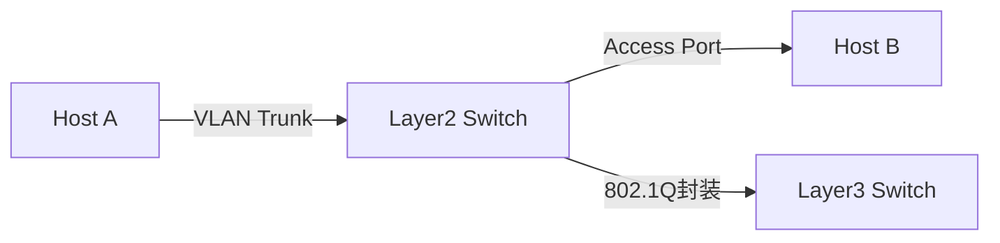

# 数据链路层复习笔记

## 摘要

本课程系统梳理数据链路层核心机制，通过帧结构分析、协议状态机建模、抓包实验设计等方法，构建可验证的链路层知识体系。重点涵盖透明传输实现、流量控制协议对比、差错检测原理及典型局域网/广域网协议实践。

## 主题

数据链路层通过帧封装实现网络层数据传递，核心管理链路通信全过程。关键技术包括：帧定界（**字符填充/零比特填充**）、流量控制（停等/GBN/SR协议对比）、差错检测（**CRC循环冗余校验**）、信道分配策略（CSMA/CD vs CSMA/CA）、典型协议实现（以太网/PPP）。

> 重点难点
>
> - 透明传输控制字符逃逸机制
> - 滑动窗口协议序列空间计算
> - 海明码校验位布局原理
> - CSMA/CD冲突检测时间窗口
> - VLAN帧结构扩展分析

## 线索区

### 协议栈定位（数据链路层）
```latex
\begin{figure}[h]
\centering
\includegraphics[width=0.8\textwidth]{osi_stack}
\caption{OSI模型中数据链路层位置}
\end{figure}
```

### 帧封装结构（以太网为例）
| 字段         | 长度(bytes) | 说明                          | Wireshark过滤        |
|--------------|-------------|-----------------------------|----------------------|
| Preamble      | 7           | 同步信号（不显示在抓包中）         | `eth.dst == ff:ff:ff:ff:ff:ff` |
| SFD           | 1           | 帧起始符(0xAB)                | `eth.type == 0x0800` |
| 目标MAC       | 6           | **广播地址为全F**              |                      |
| 源MAC         | 6           | 发送端物理地址                  |                      |
| EtherType     | 2           | 上层协议标识（IPv4:0x0800）     |                      |
| Payload       | 46-1500     | **MTU限制**                  |                      |
| FCS           | 4           | CRC32校验                    |                      |

> 实验命令：`tcpdump -i eth0 -e -vvv -XX`（显示完整链路层头部）

### 透明传输机制对比
```markdown
1. **字符填充法（PPP）**
   - 转义字符：0x7D
   - 转义规则：7E → 7D 5E，7D → 7D 5D
   - 抓包特征：载荷中出现连续7D字节

2. **零比特填充法（HDLC）**
   - 帧标志：01111110
   - 填充规则：连续5个1后插入0
   - 验证命令：`od -tx1 frame.bin | grep '7e'`
```

### 流量控制协议参数对比
| 协议类型 | 发送窗口 | 接收窗口 | 重传策略          | 典型场景       |
|----------|----------|----------|-------------------|----------------|
| 停等协议 | 1        | 1        | 超时重传          | 卫星链路       |
| GBN      | N        | 1        | 批量重传          | 局域网         |
| SR       | N        | N        | 选择性重传        | 高延迟网络     |

### CSMA/CD关键参数
```latex
冲突检测时间窗口：$\tau \geq 2\tau_{prop} + t_{jamming}$
最小帧长计算：$L_{min} = R \times 2\tau \times 10^6$（R为速率Mbps，τ为传播时延μs）
```

## 总结区

**核心考点**：
1. 帧结构各字段作用（特别注意SFD与Preamble的物理层/链路层归属）
2. 零比特填充的边界条件（连续5个1的识别与处理）
3. GBN协议中累计确认机制与窗口滑动关系
4. CRC校验多项式运算（如CRC-CCITT对应$x^{16}+x^{12}+x^5+1$）

**实验重点**：
- 使用`tshark -T fields -e eth.src`提取MAC地址
- 通过`ethtool -k eth0`验证网卡校验和卸载功能
- 构造CRC错误帧观察系统反应：`packETH -i eth0 -m 1 -d "FFFF..."`

**拓扑验证**：
