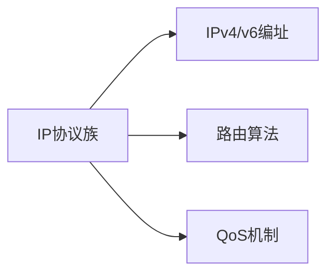

# 网络层概述与功能

## 摘要

本课程系统解析网络层核心功能，通过协议分析+实验验证模式，构建可抓包观测的知识体系。重点涵盖 IP 地址管理、路由算法实现、拥塞控制策略，提供拓扑复现与故障排查工具链。

---

## 主题

**网络层三支柱**：路由决策（控制平面）｜分组转发（数据平面）｜地址管理（逻辑编址）  
**关键技术栈**：



> 重点难点
>
> - **转发 vs 路由**：数据平面与控制平面交互逻辑
> - **子网划分**：可变长子网掩码(VLSM)计算
> - **动态路由收敛**：距离向量(DV)与链路状态(LS)算法对比
> - **CIDR 聚合**：最长前缀匹配(LPM)实现原理

---

## 线索区

### 知识点 1：IP 分组结构

**协议帧结构**（IPv4 头部）：

```plaintext
 0                   1                   2                   3   
 0 1 2 3 4 5 6 7 8 9 0 1 2 3 4 5 6 7 8 9 0 1 2 3 4 5 6 7 8 9 0 1 
+-+-+-+-+-+-+-+-+-+-+-+-+-+-+-+-+-+-+-+-+-+-+-+-+-+-+-+-+-+-+-+-+
|Version| IHL |      TOS       |         Total Length          |
+-+-+-+-+-+-+-+-+-+-+-+-+-+-+-+-+-+-+-+-+-+-+-+-+-+-+-+-+-+-+-+-+
|          Identification         |Flags|   Fragment Offset    |
+-+-+-+-+-+-+-+-+-+-+-+-+-+-+-+-+-+-+-+-+-+-+-+-+-+-+-+-+-+-+-+-+
|  TTL  | Protocol |          Header Checksum                  |
+-+-+-+-+-+-+-+-+-+-+-+-+-+-+-+-+-+-+-+-+-+-+-+-+-+-+-+-+-+-+-+-+
|                      Source Address                          |
+-+-+-+-+-+-+-+-+-+-+-+-+-+-+-+-+-+-+-+-+-+-+-+-+-+-+-+-+-+-+-+-+
|                   Destination Address                        |
+-+-+-+-+-+-+-+-+-+-+-+-+-+-+-+-+-+-+-+-+-+-+-+-+-+-+-+-+-+-+-+-+
```

| 字段名           | 位数  | 描述                     |
|------------------|-------|--------------------------|
| Version         | 4     | 协议版本 (e.g. IPv4=4)  |
| IHL             | 4     | 首部长度 (32-bit words)  |
| TOS             | 8     | 服务类型                 |
| Total Length    | 16    | 数据报总长度             |
| Identification  | 16    | 分片标识符               |
| Flags           | 3     | 分片控制标志             |
| Fragment Offset | 13    | 分片偏移量               |
| TTL             | 8     | 生存时间                 |
| Protocol        | 8     | 上层协议 (e.g. TCP=6)   |
| Header Checksum | 16    | 首部校验和               |
| Source Address  | 32    | 源 IP 地址               |
| Dest. Address   | 32    | 目的 IP 地址             |

**实验工具**：

```bash
# 捕获IP分组（Linux）
tcpdump -i eth0 -nn 'ip' -w ip_capture.pcap

# Wireshark过滤表达式
ip.src == 192.168.1.0/24 && tcp.port == 80
```

---

### 知识点 2：路由选择算法对比

**动态路由协议分类**：  

| 类型 | 协议示例 | 更新方式 | 收敛速度 | 适用场景 |
|------|----------|----------|----------|----------|
| 距离向量 | RIP | 周期广播 | 慢 | 小型网络 |
| 链路状态 | OSPF | 触发更新 | 快 | 大型企业网 |
| 路径向量 | BGP | 增量更新 | 中等 | 跨域路由 |

**状态机图解**（OSPF 邻居建立）：

```mermaid
stateDiagram-v2
    Down --> Init: Hello Received
    Init --> 2-Way: Hello with self in list
    2-Way --> ExStart: Negotiate Master/Slave
    ExStart --> Exchange: DBD packets
    Exchange --> Loading: LSR/LSU packets
    Loading --> Full: LSDB同步完成
```

---

### 知识点 3：CIDR 与子网划分

**地址聚合示例**：

```bash
192.168.1.0/26 → 62主机地址 (掩码255.255.255.192)
192.168.1.64/27 → 30主机地址 (掩码255.255.255.224)
```

**关键参数**：

- **MTU**：**1500 字节**（标准以太网）
- **最大跳数**：RIP 协议默认**15 跳**

---

## 总结区

**核心考点**：

1. IP 分片计算（标识字段+偏移量关联）
2. 路由表项优先级（管理距离+度量值）
3. ARP 协议与 ICMP 重定向的联动

**实验重点**：

```bash
# 验证路由路径（跨平台）
traceroute -n 8.8.8.8         # Linux/Unix
tracert -d 8.8.8.8           # Windows
```

**进阶方向**：

- SDN 环境下控制平面与数据平面分离实践
- IPv6 邻居发现协议(NDP)抓包分析
