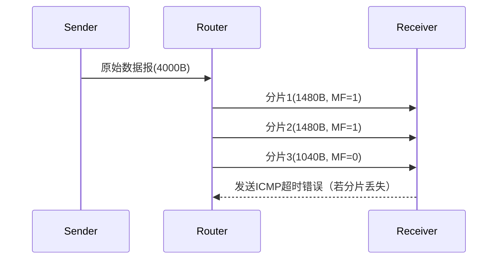

# IP数据报分片机制深度解析

## 摘要
本课程通过协议分析与实验验证相结合的方式，系统讲解IP数据报分片机制。使用Wireshark捕获实例验证分片过程，结合RFC 791标准术语解析标识、标志、片偏移字段，并给出不同操作系统下的分片测试命令。最终构建可验证的分片知识体系。

## 主题
网络层协议实现超MTU数据传输的核心机制，涉及数据报拆分/重组、字段协同工作、分片策略决策。关键词：MTU、DF位、MF位、片偏移、重组超时。

> 重点难点
> - 分片偏移量计算与单位换算
> - MF标志位与最后分片判定
> - 分片丢失对上层协议影响
> - IPv4与IPv6分片机制差异

## 线索区

### 协议分层定位
**网络层（Internet Layer）**
```latex
\begin{figure}[h]
\centering
\includegraphics[width=0.8\textwidth]{ip_fragmentation_layer.png}
\caption{分片机制在网络协议栈中的位置}
\end{figure}
```

### 协议字段详解
**IP头部结构**（RFC 791）：
```bash
 0                   1                   2                   3   
 0 1 2 3 4 5 6 7 8 9 0 1 2 3 4 5 6 7 8 9 0 1 2 3 4 5 6 7 8 9 0 1 
+-+-+-+-+-+-+-+-+-+-+-+-+-+-+-+-+-+-+-+-+-+-+-+-+-+-+-+-+-+-+-+-+
|  Identification (16 bits)     | Flags (3b) | Fragment Offset  |
+-+-+-+-+-+-+-+-+-+-+-+-+-+-+-+-+-+-+-+-+-+-+-+-+-+-+-+-+-+-+-+-+
```

**关键字段**：
- **Identification**：16位计数器（Linux默认+1递增）
- **Flags**：
  - **DF**（Don't Fragment）：`ping -M do -s 1472 1.1.1.1`
  - **MF**（More Fragments）：最后分片置0
- **Fragment Offset**：以**8字节**为单位的偏移量

### 分片过程验证
**实验环境**：
```bash
# Linux分片测试（需关闭PMTUD）
sudo sysctl -w net.ipv4.ip_no_pmtu_disc=1
ping -s 4000 192.168.1.1

# Wireshark过滤表达式
ip.flags.mf == 1 || ip.frag_offset > 0
```

**分片计算示例**：
```python
MTU = 1500
header = 20
max_data = MTU - header  # 1480字节
original_size = 4000
num_fragments = math.ceil(original_size / max_data)  # 3片
```

### 重组机制图解


## 总结区

### 核心考点
- **分片判定条件**：数据报长度 > 路径MTU且DF=0
- **偏移量计算**：实际字节偏移 = 片偏移值 × 8
- **重组超时**：典型值60秒（RFC 1122）

### 典型故障
- **分片不完整**：导致应用层数据截断
- **PMTUD黑洞**：DF位设置时MTU不匹配引发丢包
- **分片重叠攻击**：安全设备需检查offset字段合法性

### 扩展验证
```bash
# 查看系统分片统计（Linux）
cat /proc/net/snmp | grep IP: 
    IP: Forwarding DefaultTTL InReceives InHdrErrors InAddrErrors
    ForwDatagrams OutRequests OutDiscards OutNoRoutes ReasmTimeout
    ReasmReqds ReasmOKs ReasmFails
```

通过本课件的学习体系，可快速定位分片相关网络故障，理解抓包分析中的非常规数据包结构，并为后续学习Path MTU Discovery等高级主题奠定基础。