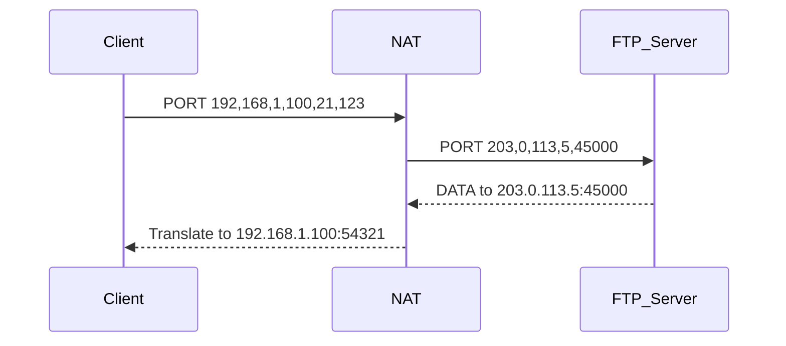

# 网络地址转换（NAT）技术

## 摘要
本课程解析NAT（Network Address Translation）技术如何通过地址映射解决IPv4地址短缺问题。基于协议栈分层原理，结合抓包实验验证NAT转换过程，重点演示地址转换表动态维护机制与端口复用技术。

## 主题
NAT实现私有网络与公网互通的三大核心要素：地址转换表、端口复用、反向报文转换。关键技术点包括NAPT（Network Address Port Translation）会话保持、锥形NAT分类、ALG（应用层网关）协议适配。

> **重点难点**
> - 动态NAT与静态NAT的会话管理差异
> - 端口受限锥形NAT的穿越限制
> - 双栈NAT在IPv6过渡期的实现原理

## 线索区

### 网络层/NAT转换表结构
```latex
\begin{tabular}{|l|l|l|l|}
\hline
\textbf{内部地址} & \textbf{内部端口} & \textbf{外部地址} & \textbf{外部端口} \\
\hline
192.168.1.100 & 54321 & 203.0.113.5 & 45000 \\
192.168.1.101 & 12345 & 203.0.113.5 & 45001 \\
\hline
\end{tabular}
```
- 端口复用：单个公网IP支持65535个并发会话
- 老化时间：TCP默认为2小时，UDP为5分钟（RFC4787）

### 传输层/协议交互验证
**Wireshark过滤式：**
```bash
(ip.src == 192.168.1.0/24 && ip.dst != 192.168.1.0/24) || 
(ip.dst == 192.168.1.0/24 && ip.src != 192.168.1.0/24)
```

**tcpdump抓包命令（Linux）：**
```bash
tcpdump -i eth1 'host 203.0.113.5 and (portrange 45000-45535)' -nn -v
```

### 应用层/ALG工作原理


## 实验指导
**1. Linux NAT配置（iptables）：**
```bash
# 启用IP转发
sysctl -w net.ipv4.ip_forward=1

# 配置SNAT（静态映射）
iptables -t nat -A POSTROUTING -o eth0 -j SNAT --to-source 203.0.113.5

# 配置DNAT（端口转发）
iptables -t nat -A PREROUTING -i eth0 -p tcp --dport 80 -j DNAT --to-destination 192.168.1.100:8080
```

**2. Windows NAT检测（PowerShell）：**
```powershell
Get-NetNatStaticMapping | Format-Table InternalIPAddress,InternalPort,ExternalIPAddress,ExternalPort
```

## 总结区
**核心考点：**
- NAT穿透技术的STUN/TURN协议对比
- **NAT444架构**对P2P应用的影响
- 端口随机化机制与安全性关系（RFC6056）

**实验验证要点：**
1. 使用`conntrack -L`查看Linux连接跟踪表
2. 通过`telnet 203.0.113.5 45000`验证端口映射
3. 抓包分析FTP ALG对PORT命令的改写过程

**拓扑复现建议：**
搭建双NAT串联环境，观测多层地址转换对traceroute结果的影响，重点关注TTL值变化规律。