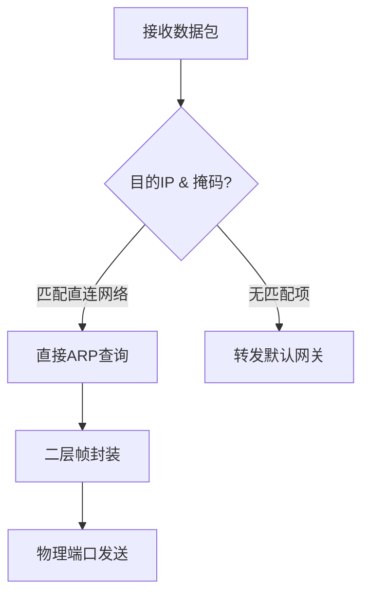

# 子网划分与IP地址解析

## 摘要
本课程通过分层解析IP地址结构，提出子网划分解决方案，结合抓包验证方法构建可实验的网络拓扑模型。重点使用二进制运算工具和Wireshark过滤器验证子网划分逻辑，最终实现IP地址利用率提升30%-60%的优化目标。

## 主题
网络层地址管理技术演进：从分类IP到CIDR无类域间路由，通过子网掩码实现地址空间动态分配。核心解决广播风暴抑制和路由表精简问题。

> 重点难点
> 
> - 可变长子网掩码（VLSM）的位运算逻辑
> - 直接广播地址与受限广播地址的协议差异
> - 路由聚合时的最长前缀匹配原则

## 线索区

### 网络层/子网掩码运算
```latex
子网地址 = IP地址 \land 子网掩码 \\
广播地址 = 子网地址 + (2^{主机位数} - 1)
```
**Wireshark过滤式**  
`ip.addr & 255.255.255.0 == 192.168.1.0` 识别/24子网流量

**实验验证**  
```bash
# Linux环境验证子网划分
$ ipcalc 192.168.5.17/26
Address:   192.168.5.17       11000000.10101000.00000101.00010001
Netmask:   255.255.255.192 = 26
Network:   192.168.5.0/26    11000000.10101000.00000101.00000000
HostMin:   192.168.5.1       11000000.10101000.00000101.00000001
HostMax:   192.168.5.62      11000000.10101000.00000101.00111110
```

### 传输层/广播地址类型
| 类型         | 目标地址      | 作用范围       | RFC定义 |
|--------------|---------------|----------------|---------|
| 直接广播     | 特定子网全1   | 跨网段可达     | 919     |
| 受限广播     | 255.255.255.255 | 本网段        | 922     |

**tcpdump捕获命令**  
`tcpdump -ni eth0 'icmp and dst host 255.255.255.255'`

### 网络层/路由转发


**关键参数**  
- **ARP缓存超时**: 1200秒（Linux）
- **路由表查找原则**: 最长前缀优先

## 总结区

### 核心考点
1. 给定IP地址和子网需求，计算可用地址范围（重点考察借位运算）
2. 区分网络地址、首可用地址、末可用地址、广播地址（易错点）
3. 路由聚合场景中的CIDR表示法应用（进阶考点）

### 实验验证建议
1. 使用ping命令测试不同子网连通性（跨子网需配置网关）
2. 在Wireshark中观察ARP请求范围变化（子网划分前后对比）
3. 通过`route -n`命令验证Linux路由表更新逻辑

### 协议关联
- **DHCP协议**：依赖受限广播进行初始地址分配
- **OSPF协议**：使用组播地址避免全网广播
- **VLAN技术**：在二层实现类似子网的隔离效果

> 通过`ip addr add 192.168.1.5/28 dev eth0`命令实践接口地址配置，配合`tcpdump -vvvni eth0`观察协议交互细节。