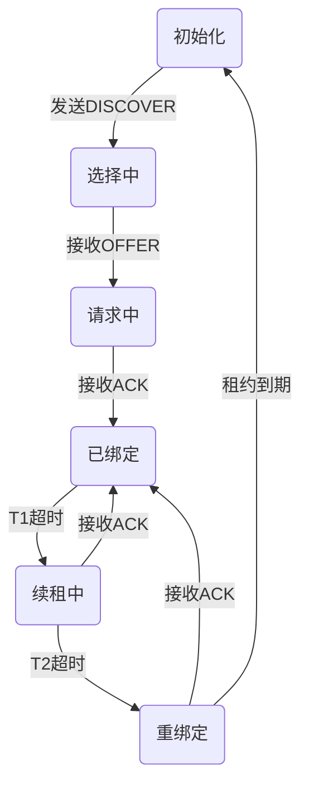
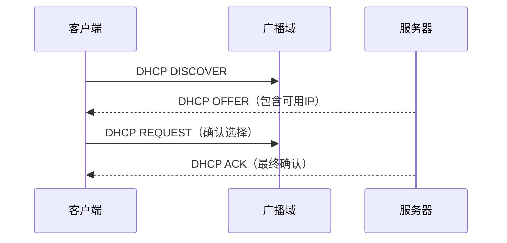

# DHCP协议详解

## 摘要  
本课程通过协议分层解析与实验验证方法，系统阐述DHCP协议的动态地址分配机制。结合Wireshark抓包实例与网络拓扑模拟，验证发现（DISCOVER）-提供（OFFER）-请求（REQUEST）-确认（ACK）四步交互过程，揭示广播通信与租约管理的核心原理。

## 主题  
应用层动态配置协议，基于UDP 67/68端口实现客户端-服务器架构，解决大规模网络终端即插即用需求。核心机制包含地址池管理、租约协商、重绑定策略。

> **重点难点**  
> - **广播域穿透**：跨VLAN场景中DHCP中继代理工作机理  
> - **租约状态机**：T1(50%)重绑定与T2(87.5%)续租超时逻辑  
> - **安全加固**：DHCP Snooping防伪基站攻击实现原理  

---

## 线索区  

### 协议栈定位  
**应用层协议**（基于UDP传输层）  
- 客户端端口：68  
- 服务器端口：67  


---

### 协议帧结构（RFC 2131）  
```latex
\begin{tabular}{|c|c|c|c|c|}
\hline
OP & HTYPE & HLEN & HOPS \\ 
\hline
XID（事务ID） \\ 
\hline
SECS & FLAGS \\ 
\hline
CIADDR（客户端IP） \\ 
\hline
YIADDR（分配IP） \\ 
\hline
SIADDR（服务器IP） \\ 
\hline
GIADDR（中继代理IP） \\ 
\hline
CHADDR（客户端MAC） \\ 
\hline
...选项字段... \\
\hline
\end{tabular}
```
**关键字段**：  
- 消息类型（Option53）：DISCOVER(1)/OFFER(2)/REQUEST(3)/ACK(5)  
- 租期时间（Option51）：**默认86400秒（24小时）**

---

### 状态机图解  


---

### 抓包验证  
**Wireshark过滤式**：  
```bash
bootp.option.dhcp == 1  # 过滤所有DHCP报文
dhcp.option.message_type == 1  # 单独显示DISCOVER报文
```

**tcpdump命令**（Linux环境）：  
```bash
tcpdump -i eth0 -vvv -s 1500 'port 67 or port 68' -w dhcp.pcap
```

---

### 地址分配时序  


---

## 总结区  

### 核心考点  
- **四步握手**：DISCOVER→OFFER→REQUEST→ACK的报文类型与载荷差异  
- **租约更新**：T1/T2定时器触发不同阶段续租行为  
- **中继代理**：GIADDR字段在跨网段分配中的核心作用  

### 实验重点  
```bash
# Windows释放IP（管理员权限）
ipconfig /release && ipconfig /renew

# Linux调试（查看租约信息）
cat /var/lib/dhcp/dhclient.leases
```

### 故障排查  
**典型场景**：客户端持续获得169.254.x.x地址  
**排查步骤**：  
1. 确认物理层连通性（`ethtool eth0`）  
2. 验证DHCP服务状态（`systemctl status isc-dhcp-server`）  
3. 检查防火墙规则（67/68端口放行）  

---

**扩展阅读**：  
- RFC 2131: DHCP协议规范  
- 《TCP/IP详解卷1》第16章 BOOTP与DHCP  
- Wireshark官方DHCP分析案例库