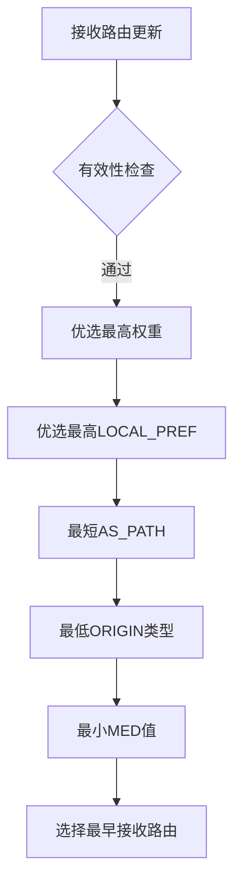

# BGP协议与路由选择协议比较

## 摘要
**目的**：解析BGP协议工作机制及与IGP协议的差异  
**方法**：通过协议栈分层分析、抓包实验验证、路由策略对比  
**结果**：明确BGP在跨AS路由中的路径矢量特性与防环机制  
**结论**：BGP作为EGP协议核心，通过TCP实现可靠路由交换，支撑互联网自治系统互联  

---

## 主题
**核心内容**：BGP报文交互机制 | 路径属性决策 | 跨协议对比分析  
**关键词**：`AS（Autonomous System）` `路径矢量` `TCP 179端口` `UPDATE报文`  
**问题提示**：  
- BGP如何通过AS_PATH属性避免路由环路？  
- 相比OSPF，BGP为何采用增量更新策略？  

> **重点难点**
> - BGP状态机与TCP会话的耦合关系
> - MED属性与LOCAL_PREF的决策优先级
> - 路由反射器对IBGP全互联要求的突破

---

## 线索区

### 协议栈定位（应用层）
```latex
\begin{figure}[h]
\centering
\includegraphics[width=0.8\textwidth]{bgp_stack}
\caption{BGP协议栈位置（基于TCP/179端口）}
\end{figure}
```
**抓包验证**：
```bash
# Wireshark过滤表达式
tcp.port == 179 && bgp

# tcpdump命令（Linux环境）
tcpdump -i eth0 -nnvvXSs 0 'tcp port 179' -w bgp.pcap
```

---

### BGP报文类型对比
| 类型        | 十六进制标识 | 功能说明                     | 典型长度 |
|-------------|--------------|------------------------------|----------|
| OPEN        | 0x01         | 建立BGP邻居关系              | 29字节   |
| UPDATE      | 0x02         | 通告/撤销路由条目            | 可变     |
| KEEPALIVE   | 0x03         | 维持邻居状态                 | 19字节   |
| NOTIFICATION| 0x04         | 错误通告与连接终止           | 21+字节  |

**实验验证**：
```bash
# 查看BGP邻居状态（Cisco设备）
show ip bgp summary 

# 强制发送NOTIFICATION报文测试
debug bgp neighbor-events
```

---

### 路由选择对比矩阵
| 维度        | RIP（距离矢量）      | OSPF（链路状态）       | BGP（路径矢量）        |
|-------------|----------------------|------------------------|------------------------|
| **协议类型** | IGP                  | IGP                   | EGP                   |
| **传输协议** | UDP/520              | IP/89                 | TCP/179               |
| **度量标准** | 跳数                 | 开销（带宽）          | 路径属性集合          |
| **更新方式** | 周期全量             | 触发增量              | 触发增量              |
| **防环机制** | 最大跳数             | SPF算法               | AS_PATH属性检查       |

---

### BGP路由决策流程


**典型抓包特征**：
```wireshark-filter
bgp.update.path_attribute.community contains 65001:100
```

---

## 总结区

### 核心考点
1. **报文交互**：TCP三次握手后通过OPEN报文建立BGP会话，KEEPALIVE间隔**60秒**
2. **路径属性**：`AS_PATH`（必遵）>`LOCAL_PREF`>`MED`（选遵）的决策优先级
3. **环路防护**：通过检查自身AS号是否存在于AS_PATH字段中实现

### 实验要点
```bash
# 模拟BGP路由震荡（Linux Quagga）
vtysh -c "show ip bgp 192.168.0.0/24 detail"
vtysh -c "clear ip bgp * soft"
```

### 故障排查
```wireshark-filter
# 检测BGP会话中断
bgp.type == 3 && bgp.notification.code == 6（Cease错误码）
```

---

**延伸思考**：在SDN架构中，BGP-LS如何扩展传统BGP协议实现拓扑信息收集？