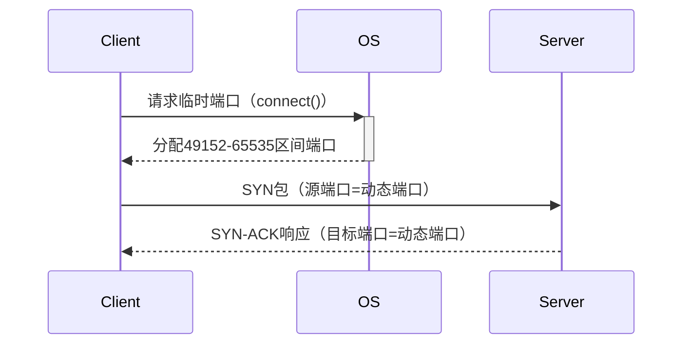

# 传输层协议与端口号管理

## 摘要
本课程通过协议分析与实验验证方法，解析传输层核心协议（TCP/UDP）工作机制与端口管理策略。通过Wireshark抓包演示TCP三次握手过程，结合tcpdump命令验证端口分配规律，最终建立基于协议栈分层的传输层认知框架。

## 主题
传输层服务实现原理与验证方法，重点关注以下维度：
- TCP可靠传输机制验证（三次握手/流量控制）
- UDP无连接特性实验对比
- 端口号分配策略与套接字定位原理

> 重点难点
> - **TCP滑动窗口与拥塞控制的协同机制**
> - **短连接场景下的端口快速回收策略**
> - **NAT（Network Address Translation）环境下的端口映射跟踪**

## 线索区

### 知识点1：TCP/UDP协议对比
```latex
\begin{table}[h]
\centering
\caption{TCP与UDP协议对比}
\begin{tabular}{|l|l|l|}
\hline
特性 & TCP & UDP \\ \hline
连接性 & 面向连接（状态机维护） & 无连接 \\ \hline
可靠性 & \textbf{确认重传机制} & 最大努力交付 \\ \hline
首部开销 & 20字节（标准头） & 8字节 \\ \hline
适用场景 & 文件传输/Web浏览 & DNS/视频流 \\ \hline
\end{tabular}
\end{table}
```
**Wireshark过滤式**  
- TCP分析：`tcp.flags.syn==1 and tcp.flags.ack==0`（捕获SYN包）
- UDP分析：`udp.length > 512`（捕获大载荷数据报）

**实验命令**  
```bash
# 捕获TCP建连过程（Linux）
tcpdump -i eth0 'tcp port 80 and (tcp-syn|tcp-ack)!=0' -w tcp_handshake.pcap

# UDP吞吐测试（Windows）
iperf -c 192.168.1.100 -u -b 100M
```

### 知识点2：端口管理机制
**动态端口分配流程**  


**关键参数**  
- **临时端口范围**：Linux默认32768-60999（/proc/sys/net/ipv4/ip_local_port_range）
- **TIME_WAIT时长**：**2MSL（60秒）**，防止旧连接报文干扰

### 知识点3：套接字实践解析
**五元组定位原理**  
`<源IP, 源端口, 目的IP, 目的端口, 协议类型>`  

**网络调试命令**  
```powershell
# 查看当前连接状态（Windows）
netstat -ano | findstr :80

# 查看端口占用进程（Linux）
lsof -i :22
```

## 总结区
### 核心考点
1. **TCP三次握手故障诊断**：通过Wireshark验证SYN重传间隔（指数退避算法）
2. **端口耗尽问题**：分析`netstat`输出中的TIME_WAIT状态堆积
3. **NAT穿透问题**：STUN协议如何通过端口绑定发现公网映射

### 实验重点
- 使用`nc`命令创建TCP/UDP测试连接
- 通过`ss -tunap`命令监控端口使用情况
- 配置Wireshark着色规则突出异常报文（如RST包）

### 进阶方向
- 研究Linux内核的端口分配算法（Robin-round vs. 哈希分配）
- 分析QUIC协议如何重构传输层服务（UDP承载可靠传输）

---

根据实际教学需求，可提供以下扩展支持：
1. TCP状态机转换图示（含11种状态迁移条件）
2. Wireshark Expert Info对异常握手的诊断方法
3. 企业级NAT环境下端口跟踪案例库