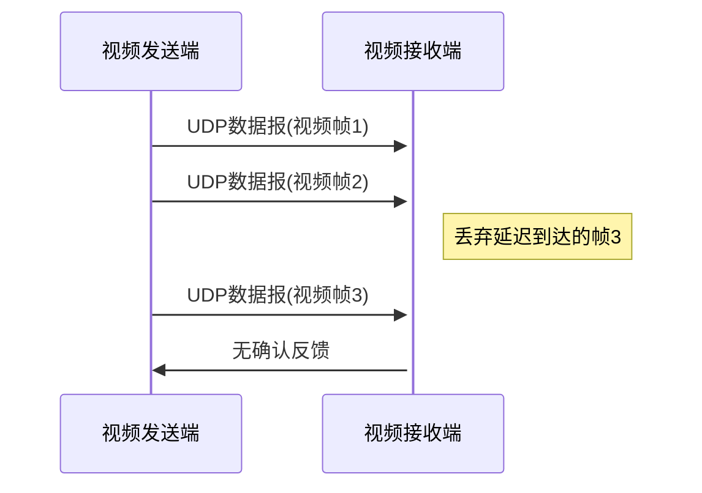

# UDP协议详解

## 摘要
本课程解析UDP协议核心机制，通过抓包验证、协议结构分析和校验和计算演示，构建可实验验证的网络知识体系。重点涵盖无连接特性验证方法、头部字段解析技巧及校验和故障排查实践。

## 主题
传输层无连接协议设计原理与实践验证，重点关注报文结构、校验机制和实时应用场景。

> 重点难点
> - 伪首部校验和计算流程
> - 面向报文传输与分片机制关系
> - 无拥塞控制对实时业务的影响

## 线索区

### 传输层协议对比
\#protocol-comparison
```latex
\begin{tabular}{|l|l|l|}
\hline
特性 & TCP & UDP \\
\hline
连接方式 & 面向连接 & \textbf{无连接} \\
可靠性 & 确认重传 & \textbf{最大努力交付} \\
头部开销 & \textbf{20-60字节} & 8字节 \\
流量控制 & 滑动窗口 & 无 \\
\hline
\end{tabular}
```

### UDP头部结构
\#protocol-frame
```latex
\begin{bytefield}{32}
\bitheader{0-31} \\
\bitbox{16}{源端口} & \bitbox{16}{目的端口} \\
\bitbox{16}{长度} & \bitbox{16}{校验和} \\
\wordbox[lrt]{1}{数据载荷} \\
\skippedwords \\
\wordbox[lrb]{1}{}
\end{bytefield}
```
**字段说明**：
- 长度字段：包含头部的总长度（最小8字节）
- 校验和：覆盖伪首部+头部+数据

### 校验和计算实验
\#error-checking
**实验命令**：
```bash
# 生成测试数据包
echo "UDP test" | nc -u -w1 192.168.1.100 54321

# 抓包验证校验和
tcpdump -vvv -nn -i eth0 'udp and port 54321' -X
```
**计算步骤**：
1. 构造伪首部（src_ip + dst_ip + proto + udp_len）
2. 将UDP数据报按16位字对齐（补0填充）
3. 所有字进行二进制反码求和
4. 结果取反存入校验和字段

### 实时应用场景
\#qos-analysis


## 总结区

### 核心考点
1. 校验和计算必须包含伪首部的设计意义（防止路由欺骗）
2. **最大报文长度**计算：$$MaxData = 65535 - 8 - 20 = 65507 \text{ bytes}$$
3. 分片与重组对应用层的影响（DF标志位设置）

### 实验重点
- Wireshark过滤表达式：`udp && ip.addr == 192.168.1.100`
- 校验和异常检测：`tcpdump -vvv udp and port 53`
- MTU测试命令：`ping -M do -s 1472 192.168.1.1`

### 故障排查案例
**现象**：NTP时间同步失败  
**排查步骤**：
1. 检查防火墙规则：`iptables -L -n -v`
2. 抓包验证双向通信：`tcpdump -i eth0 udp port 123`
3. 校验和验证：`tshark -r ntp.pcap -T fields -e udp.checksum_status`