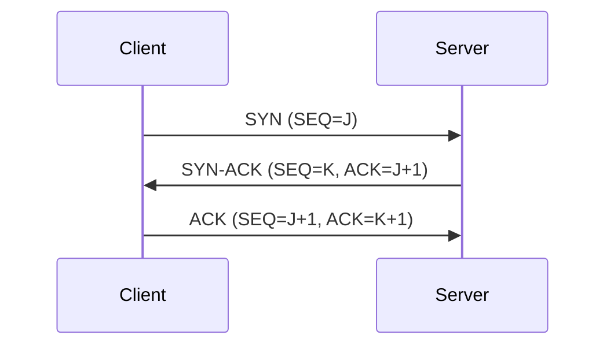

# TCP协议详解

## 摘要
本笔记系统解析TCP协议核心机制，通过协议帧结构分析、状态机图解及实验验证方法，构建可抓包验证的网络知识体系。重点覆盖连接管理、可靠传输原理及关键字段功能验证。

## 主题
传输层可靠通信协议，面向连接/全双工/流量控制为核心特征。核心验证方法：通过三次握手抓包解析SEQ/ACK序列，FIN/RST状态转换观察，窗口尺寸动态调整实验。

> 重点难点
> 
> - **三次握手时序验证**：SYN洪水攻击检测方法
> - **滑动窗口动态调整**：带宽延迟积(BDP)计算
> - **状态机异常转换**：RST攻击场景复现

---

## 线索区

### 协议分层定位
**传输层协议**（RFC 793）  
- 端口寻址范围：`0-65535`（**知名端口0-1023需特权访问**）
- 服务访问点(SAP)标识：`IP地址:端口号`二元组

```latex
% 协议栈定位图示
\begin{figure}[h]
    \centering
    \includegraphics[width=0.6\textwidth]{tcp_stack}
    \caption{TCP/IP协议栈层级关系}
\end{figure}
```

---

### 报文结构解析
**固定头部20字节**（扩展选项可达60字节）  

| 字段名         | 长度   | 功能说明                  | Wireshark过滤            |
|----------------|--------|---------------------------|--------------------------|
| Source Port    | 16bit  | 源端口号                  | `tcp.srcport == 80`      |
| Sequence Number| 32bit  | 数据字节流编号            | `tcp.seq >= 1000`        |
| Window Size    | 16bit  | **接收窗口可用空间**      | `tcp.window_size < 4096` |
| Flags          | 6bit   | URG/ACK/PSH/RST/SYN/FIN   | `tcp.flags.syn == 1`     |

**MTU限制**：以太网环境下**有效载荷最大1460字节**（1500 MTU - 20 IP头 - 20 TCP头）

---

### 三次握手过程
**状态转换验证命令**：
```bash
# Linux抓取握手过程（sudo权限）
tcpdump -i eth0 'tcp port 80 and (tcp-syn|tcp-ack)'

# Windows等效命令（需安装npcap）
netsh trace start capture=yes IPv4.Address=192.168.1.100
```

**时序验证要点**：
1. 初始序列号(ISN)随机化机制
2. SYN-ACK必须携带`ACK=ISN+1`
3. 半连接队列溢出防护（SYN Cookies）



---

### 流量控制机制
**滑动窗口动态调整实验**：
```bash
# 实时监控窗口变化（Linux）
watch -n 1 "cat /proc/net/snmp | grep Tcp"
```

**关键参数关联**：
- **接收窗口(rwnd)**：通告可用缓冲区
- **拥塞窗口(cwnd)**：发送方计算的网络容量
- 有效窗口 = min(rwnd, cwnd)

**高速公路类比**：  
窗口尺寸类比车道数量，丢包相当于交通事故触发匝道控制（拥塞避免）

---

## 总结区

### 核心验证方法
- **连接建立验证**：`tcp.flags.syn==1 and tcp.flags.ack==1`
- **快速重传检测**：`tcp.analysis.duplicate_ack`
- **零窗口事件**：`tcp.window_size == 0`

### 典型考点
1. TIME_WAIT状态持续时间（2MSL计算）
2. 延迟确认定时器（RFC 1122规定≤500ms）
3. Nagle算法与糊涂窗口综合征的相互作用

### 实验设计参考
```bash
# 制造零窗口场景（Linux）
tc qdisc add dev eth0 root netem delay 100ms rate 1kbps
```

通过协议字段解析与网络行为验证的深度结合，建立可观测、可复现的TCP协议分析框架。