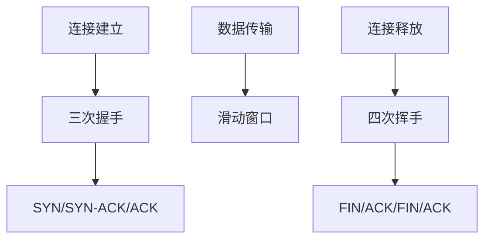
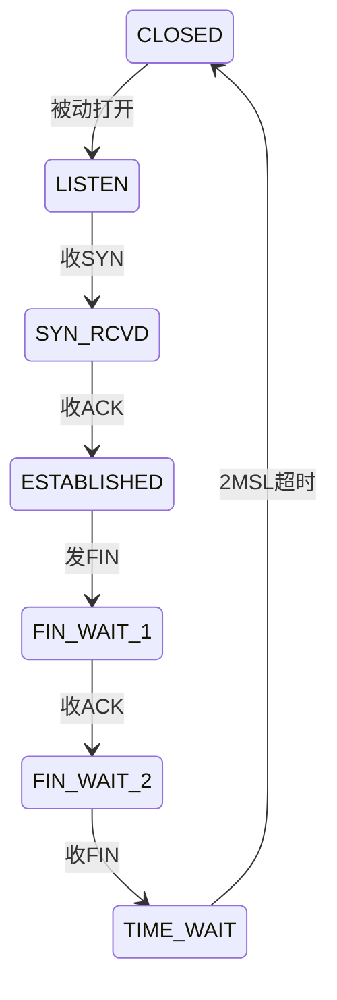

# TCP连接管理

## 摘要

本课程系统解析TCP连接管理机制，通过抓包实验验证三次握手与四次挥手的报文交换过程，结合Wireshark过滤语法与tcpdump命令实现协议行为可视化。重点攻克连接建立/释放时序控制、资源分配策略及典型攻击防御方案，构建可实验验证的TCP连接管理知识体系。

---

## 主题

### 协议分层标签
`传输层/TCP协议`

### 核心架构


> 重点难点
> - 三次握手序列号同步机制
> - TIME-WAIT状态与2MSL定时器
> - 半关闭连接状态转换
> - SYN Flooding攻击防御原理

---

## 线索区

### 知识点1：三次握手协议分析
**协议帧结构**：
```latex
\begin{bytefield}{32bit}
    \bitheader{0-31} \\
    \bitbox{16}{源端口} & \bitbox{16}{目的端口} \\
    \bitbox{32}{序列号（SEQ=X）} \\
    \bitbox{32}{确认号（ACK=X+1）} \\
    \bitbox{4}{数据偏移} & \bitbox{4}{保留} & \bitbox{8}{控制字段} & \bitbox{16}{窗口大小} \\
    \bitbox{16}{校验和} & \bitbox{16}{紧急指针} \\
    \begin{rightwordgroup}{选项}
        \bitbox{8}{类型} & \bitbox{8}{长度} & \bitbox{16}{数据} 
    \end{rightwordgroup}
\end{bytefield}
```

**Wireshark过滤式**：
```bash
tcp.flags.syn==1 and tcp.flags.ack==0  # 捕获SYN报文
tcp.stream eq <编号>  # 追踪完整TCP流
```

**实验命令**：
```bash
# Linux环境抓取握手过程
tcpdump -i eth0 'tcp port 80 and (tcp-syn|tcp-ack)'
```

---

### 知识点2：四次挥手状态机
**状态转换图**：


**关键参数**：
- **FIN_WAIT_2超时**: 默认60秒
- **TIME_WAIT持续时间**: **2MSL（通常120秒）**

---

### 知识点3：SYN Flood防御
**攻击原理对比**：
| 正常连接           | SYN Flood攻击       |
|--------------------|---------------------|
| 完成三次握手       | 仅发送SYN不响应ACK  |
| 分配连接资源       | 耗尽服务器资源      |

**防御方案**：
```python
# SYN Cookie生成算法（简化示例）
def generate_syn_cookie(src_ip, src_port, dst_ip, dst_port, secret):
    hash = HMAC(secret, f"{src_ip}:{src_port}-{dst_ip}:{dst_port}")
    return hash[:32]  # 将哈希值编码到初始序列号
```

---

### 知识点4：2MSL机制验证
**实验设计**：
```bash
# 观察TIME-WAIT状态
netstat -ant | grep TIME_WAIT

# 强制缩短MSL测试（Linux）
sysctl -w net.ipv4.tcp_fin_timeout=30
```

**典型报文流**：
```
客户端: FIN(seq=u)
服务端: ACK(ack=u+1)
        ...（数据传输）...
服务端: FIN(seq=w)
客户端: ACK(ack=w+1) → 进入TIME-WAIT
```

---

## 总结区

### 协议分析要点
1. **三次握手必要性**：解决网络延迟导致的旧连接请求问题
2. **四次挥手非对称**：支持半关闭状态下的数据传输
3. **SYN Cookie创新**：无状态防御与资源保护的平衡

### 实验验证重点
- 使用`tshark -z conv,tcp`统计TCP会话状态
- 通过`sysctl -a | grep tcp_retries`查看重传参数
- **MTU与MSS协商**：抓包观察TCP选项字段

### 高频考点
1. 为什么不能合并FIN和ACK报文？
2. 大量TIME_WAIT连接对服务器的影响
3. SYN Cookie如何验证客户端合法性？

> 下阶段建议：结合BGP状态机分析网络层与会话层协议的协同机制