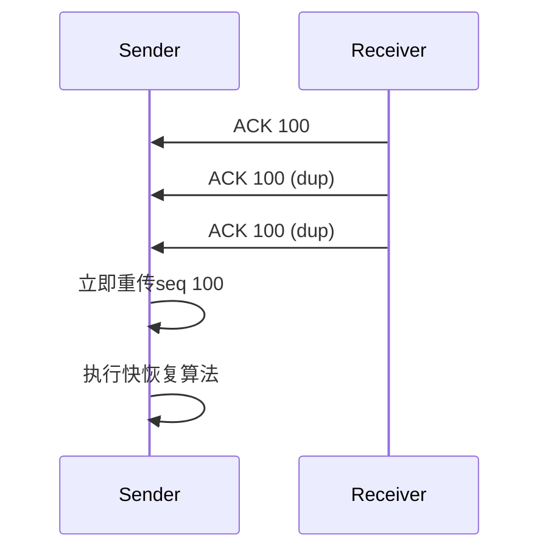

# TCP拥塞控制与快重传、快恢复机制

## 摘要
本课程通过分层解析TCP拥塞控制机制，建立可抓包验证的认知框架。采用慢开始/拥塞避免算法实现带宽探测，通过快重传/快恢复优化丢包响应。结合Wireshark过滤式与Linux网络命名空间实验，验证拥塞窗口动态调整过程。

## 主题
TCP拥塞控制通过**动态窗口调节**平衡网络负载，核心算法包含**慢开始指数增长**与**拥塞避免线性增长**。快重传机制基于**冗余ACK检测**实现快速丢包恢复，快恢复通过**门限值重置**避免性能悬崖。

> 重点难点
> 
> - 拥塞窗口（cwnd）与通告窗口（rwnd）的协同控制
> - 慢开始门限（ssthresh）在算法切换中的关键作用
> - 快重传触发条件与重复ACK计数机制

## 线索区

### 知识点1：协议栈分层定位（传输层）
```latex
\begin{figure}[h]
\centering
\includegraphics[width=0.6\textwidth]{tcp-layer.png}
\caption{TCP拥塞控制在协议栈中的位置}
\end{figure}
```

**Wireshark过滤式**：
```bash
tcp.analysis.retransmission || tcp.analysis.fast_retransmission
```

**实验命令**：
```bash
# Linux网络命名空间实验环境搭建
sudo ip netns add sender
sudo ip netns add receiver
sudo ip link add veth0 type veth peer name veth1
```

### 知识点2：慢开始与拥塞避免
**状态机转换条件**：
```
       超时事件
     ↗_________↖
慢开始 → 拥塞避免
     ↖__________↗
      cwnd ≥ ssthresh
```

**关键参数对比**：
| 阶段       | 窗口增长方式 | 触发条件           |
|------------|--------------|--------------------|
| 慢开始     | 指数增长     | cwnd < ssthresh    |
| 拥塞避免   | 线性增长     | cwnd ≥ ssthresh    |

**tcpdump观测点**：
```bash
tcpdump -ni eth0 'tcp[tcpflags] & (tcp-ack) != 0 and tcp[14:2] > 0'
```

### 知识点3：快重传与快恢复
**冗余ACK处理流程**：


**操作系统差异**：
- Linux默认使用**CUBIC算法**
- Windows采用**Compound TCP**
- 可修改算法：
  ```bash
  sysctl -w net.ipv4.tcp_congestion_control=reno
  ```

## 总结区

**核心考点**：
1. 拥塞窗口与通告窗口的**协同控制机制**
2. 慢开始阶段**指数增长**到ssthresh的临界点判断
3. 快重传的**3个重复ACK触发条件**

**实验验证要点**：
- 使用**tc命令**模拟网络丢包：
  ```bash
  tc qdisc add dev eth0 root netem loss 5%
  ```
- 通过**ss命令**实时观测cwnd变化：
  ```bash
  watch -n 0.5 'ss -ti | grep cwnd'
  ```

**协议对比**：
| 机制         | 传统恢复          | 快恢复            |
|--------------|-------------------|-------------------|
| 触发条件     | RTO超时           | 3 dup ACKs        |
| cwnd重置值   | 1                 | ssthresh + 3      |
| 后续增长方式 | 慢开始 → 拥塞避免 | 直接进入拥塞避免  |

**故障排查提示**：
当出现**吞吐量突降**时，检查：
1. 是否触发超时重传（tcp.analysis.retransmission）
2. 重复ACK计数是否达到阈值（tcp.analysis.duplicate_ack）