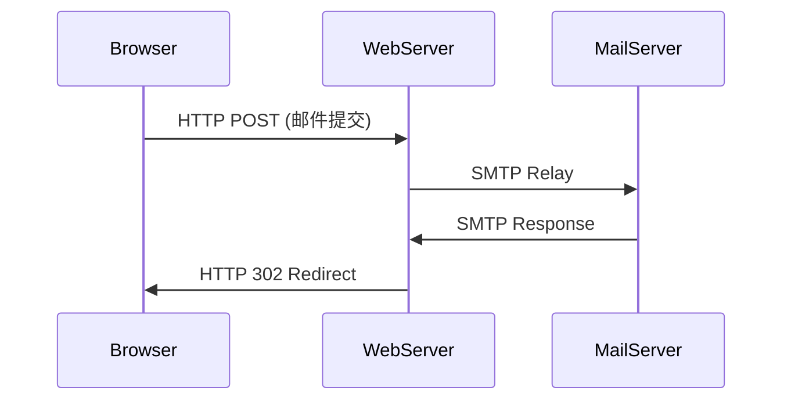

# 电子邮件系统与协议

## 摘要
本课解析电子邮件系统架构及核心协议实现，通过协议分层解析与抓包验证方法，构建可实验验证的知识体系。重点涵盖SMTP/POP3协议状态机、MIME编码机制及HTTP邮件系统实现差异，提供Wireshark过滤规则与命令行测试方案。

## 主题
电子邮件系统采用C/S架构实现邮件中继传输，核心协议组包含：
- **传输协议**：SMTP（发件）、POP3/IMAP（收件）
- **扩展协议**：MIME（多媒体扩展）
- **Web接入**：HTTP协议集成

> 重点难点
> - SMTP命令流与状态码映射关系
> - POP3两种工作模式（**Delete-Mode** vs **Keep-Mode**）对比
> - MIME边界分隔符在抓包中的识别
> - HTTP邮件系统与传统邮件系统的协议栈差异

## 线索区

### 协议分层架构
**应用层协议组**：
```latex
\begin{figure}[h]
\centering
\small
\begin{tikzpicture}[node distance=2cm]
\node (smtp) {SMTP(25/TCP)};
\node (pop3) [below of=smtp] {POP3(110/TCP)};
\node (imap) [below of=pop3] {IMAP(143/TCP)};
\node (http) [right of=smtp,xshift=3cm] {HTTP/HTTPS};
\draw[->,thick] (smtp) -- node[right] {发件通道} (pop3);
\draw[->,thick] (http) -- node[above] {Webmail接口} (smtp);
\end{tikzpicture}
\end{figure}
```

### SMTP协议详解
**帧结构特征**：
```plaintext
EHLO example.com
MAIL FROM:<sender@domain>
RCPT TO:<receiver@domain>
DATA
Subject: Test
From: sender@domain
To: receiver@domain

This is a test message
.
QUIT
```

**状态机关键节点**：
1. 连接建立（220 Service Ready）
2. 邮件传输（250 Requested mail action completed）
3. 连接终止（221 Closing transmission channel）

**Wireshark过滤**：
```bash
smtp && tcp.port == 25  # 基础过滤
smtp.response.code > 500  # 异常状态码捕获
```

**实验命令**：
```bash
# Linux邮件测试（需安装telnet）
telnet mail.server.com 25
Trying 192.168.1.1...
Connected to mail.server.com.
220 mx1.example.com ESMTP Postfix
EHLO client.example.com
```

### MIME编码机制
**协议扩展结构**：
```http
Content-Type: multipart/mixed; boundary="----=_NextPart_000_001"
Content-Transfer-Encoding: base64

------=_NextPart_000_001
Content-Type: text/plain; charset=UTF-8
VGhpcyBpcyBhIGJhc2U2NCBlbmNvZGVkIHRleHQ=
```

**抓包识别要点**：
- **boundary参数**定义数据块分隔符
- **Content-Transfer-Encoding**标记编码方式（base64/quoted-printable）

### POP3 vs IMAP
| 特性               | POP3                      | IMAP                      |
|--------------------|---------------------------|---------------------------|
| 邮件存储           | 客户端本地存储            | 服务器端保留副本          |
| 连接模式           | 短连接                    | 长连接                    |
| 部分获取           | 不支持                    | 支持邮件头/正文分离获取   |
| 状态同步           | 单设备有效                | 多设备同步                |

**POP3工作模式**：
1. **Download-Delete**：邮件下载后服务器删除（默认模式）
2. **Download-Keep**：保留服务器副本（需客户端显式配置）

### Webmail协议栈
**混合协议架构**：


**关键抓包点**：
```bash
# Web邮件提交捕获
tshark -i eth0 -Y 'http.request.method == POST && http.content_type contains "multipart/form-data"'
```

## 总结区

### 核心考点
- **SMTP状态码映射**：501（参数错误） vs 550（邮箱不可达）
- **MIME边界冲突**：实际抓包中自动生成的boundary格式特征
- **协议端口记忆**：SMTP(25)、POP3(110)、IMAP(143)、SMTPS(465)

### 实验重点
1. **SMTP协议逆向分析**：
   ```bash
   tcpdump -nnvX -s0 port 25 -w smtp.pcap
   ```
2. **MIME编码验证**：
   ```python
   # Base64解码测试
   import base64
   print(base64.b64decode('VGhpcyBpcyB...'))
   ```

### 故障排查
- **邮件延迟**：检查SMTP对话中`DATA`阶段时间戳间隔
- **附件丢失**：验证MIME报文中的boundary闭合完整性
- **认证失败**：捕获AUTH PLAIN流量时注意Base64伪装编码

---

**操作提示**：在CentOS环境测试SMTP协议时，建议使用`swaks`工具进行端到端测试：
```bash
swaks --to user@example.com --server mail.example.com --auth LOGIN
```